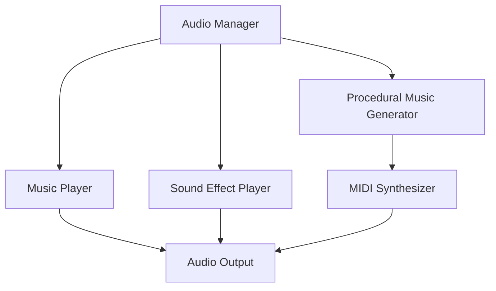

# Audio API Reference

## Introduction

PokeNET's audio system combines traditional audio playback with procedural music generation using **DryWetMidi**. This powerful system enables dynamic, context-aware soundscapes.

## Audio Architecture



## IAudioApi Interface

The main interface for audio operations:

```csharp
public interface IAudioApi
{
    // Music playback
    void PlayMusic(string trackId, bool loop = true, float fadeInTime = 0f);
    void StopMusic(float fadeOutTime = 0f);
    void PauseMusic();
    void ResumeMusic();
    void SetMusicVolume(float volume);

    // Sound effects
    void PlaySound(string soundId, float volume = 1.0f);
    void PlaySound(string soundId, Vector2 position, float volume = 1.0f);
    void StopAllSounds();

    // Procedural music
    IProceduralMusic CreateProceduralMusic(MusicSettings settings);
    void PlayProceduralMusic(IProceduralMusic music, bool loop = true);

    // Audio control
    float MasterVolume { get; set; }
    float MusicVolume { get; set; }
    float SoundVolume { get; set; }
    bool IsMusicPlaying { get; }
}
```

## Basic Audio Playback

### Playing Music

```csharp
// Simple music playback
Api.Audio.PlayMusic("battle_theme", loop: true);

// With fade-in
Api.Audio.PlayMusic("route_music", loop: true, fadeInTime: 2.0f);

// Stop with fade-out
Api.Audio.StopMusic(fadeOutTime: 1.5f);

// Pause and resume
Api.Audio.PauseMusic();
// ... later ...
Api.Audio.ResumeMusic();
```

### Playing Sound Effects

```csharp
// Simple sound
Api.Audio.PlaySound("move_hit");

// With custom volume
Api.Audio.PlaySound("explosion", volume: 0.8f);

// Positional audio (3D sound)
var creaturePosition = entity.Get<Position>();
Api.Audio.PlaySound(
    "creature_cry",
    new Vector2(creaturePosition.X, creaturePosition.Y),
    volume: 1.0f);
```

### Volume Control

```csharp
// Master volume (affects everything)
Api.Audio.MasterVolume = 0.7f; // 70%

// Music volume
Api.Audio.MusicVolume = 0.8f; // 80%

// Sound effects volume
Api.Audio.SoundVolume = 0.9f; // 90%

// Final volume calculation:
// actual = masterVolume * categoryVolume * soundVolume
```

## Procedural Music Generation

### Music Settings

```csharp
public class MusicSettings
{
    /// <summary>
    /// Tempo in BPM (beats per minute)
    /// </summary>
    public int Tempo { get; set; } = 120;

    /// <summary>
    /// Time signature (e.g., 4/4, 3/4)
    /// </summary>
    public TimeSignature TimeSignature { get; set; } = new(4, 4);

    /// <summary>
    /// Musical key
    /// </summary>
    public NoteName Key { get; set; } = NoteName.C;

    /// <summary>
    /// Scale type (major, minor, etc.)
    /// </summary>
    public ScaleType Scale { get; set; } = ScaleType.Major;

    /// <summary>
    /// Overall mood/feel of the music
    /// </summary>
    public MusicMood Mood { get; set; } = MusicMood.Neutral;

    /// <summary>
    /// Length in measures
    /// </summary>
    public int Measures { get; set; } = 16;

    /// <summary>
    /// Complexity level (0-100)
    /// </summary>
    public int Complexity { get; set; } = 50;
}

public enum MusicMood
{
    Calm,
    Happy,
    Sad,
    Tense,
    Mysterious,
    Epic,
    Neutral
}

public enum ScaleType
{
    Major,
    Minor,
    Dorian,
    Phrygian,
    Lydian,
    Mixolydian,
    Aeolian,
    Locrian,
    Pentatonic,
    Blues
}
```

### Creating Procedural Music

```csharp
// Create music settings
var settings = new MusicSettings
{
    Tempo = 140,
    TimeSignature = new TimeSignature(4, 4),
    Key = NoteName.D,
    Scale = ScaleType.Minor,
    Mood = MusicMood.Tense,
    Measures = 32,
    Complexity = 65
};

// Generate procedural music
var music = Api.Audio.CreateProceduralMusic(settings);

// Add tracks
music.AddTrack("melody", new TrackSettings
{
    Instrument = MidiProgram.Violin,
    Volume = 0.8f,
    Pattern = PatternType.Melodic,
    Notes = GetScaleNotes(settings.Key, settings.Scale)
});

music.AddTrack("bass", new TrackSettings
{
    Instrument = MidiProgram.AcousticBass,
    Volume = 0.9f,
    Pattern = PatternType.Rhythmic,
    Notes = GetBassNotes(settings.Key)
});

music.AddTrack("drums", new TrackSettings
{
    Instrument = MidiProgram.DrumSet,
    Volume = 0.7f,
    Pattern = PatternType.Percussive
});

// Play the generated music
Api.Audio.PlayProceduralMusic(music, loop: true);
```

### Track Settings

```csharp
public class TrackSettings
{
    /// <summary>
    /// MIDI instrument
    /// </summary>
    public MidiProgram Instrument { get; set; }

    /// <summary>
    /// Track volume (0-1)
    /// </summary>
    public float Volume { get; set; } = 1.0f;

    /// <summary>
    /// Pattern generation type
    /// </summary>
    public PatternType Pattern { get; set; }

    /// <summary>
    /// Available notes for this track
    /// </summary>
    public NoteName[] Notes { get; set; }

    /// <summary>
    /// Note duration range
    /// </summary>
    public (MusicalTimeSpan Min, MusicalTimeSpan Max) NoteDuration { get; set; }

    /// <summary>
    /// Note density (notes per measure)
    /// </summary>
    public int Density { get; set; } = 8;

    /// <summary>
    /// Octave range
    /// </summary>
    public (int Min, int Max) OctaveRange { get; set; } = (3, 5);

    /// <summary>
    /// Apply swing/groove
    /// </summary>
    public float Swing { get; set; } = 0f;
}

public enum PatternType
{
    Melodic,      // Flowing melody
    Rhythmic,     // Repeated rhythmic pattern
    Harmonic,     // Chord progression
    Arpeggio,     // Arpeggiated pattern
    Percussive,   // Drum pattern
    Ambient,      // Atmospheric pads
    Custom        // User-defined pattern
}
```

## Procedural Music Examples

### Example 1: Battle Music

```csharp
using PokeNET.ModApi;
using PokeNET.ModApi.Audio;
using Melanchall.DryWetMidi.MusicTheory;

public class BattleMusicGenerator
{
    private readonly IAudioApi _audio;

    public BattleMusicGenerator(IAudioApi audio)
    {
        _audio = audio;
    }

    public void GenerateBattleMusic(int intensity)
    {
        // Tempo increases with intensity
        int tempo = 120 + (intensity * 10);

        var settings = new MusicSettings
        {
            Tempo = tempo,
            TimeSignature = new TimeSignature(4, 4),
            Key = NoteName.E,
            Scale = ScaleType.Minor,
            Mood = MusicMood.Tense,
            Measures = 16,
            Complexity = 60 + intensity
        };

        var music = _audio.CreateProceduralMusic(settings);

        // Aggressive lead
        music.AddTrack("lead", new TrackSettings
        {
            Instrument = MidiProgram.Distortion,
            Volume = 0.85f,
            Pattern = PatternType.Melodic,
            Notes = new[] { NoteName.E, NoteName.G, NoteName.A, NoteName.B },
            Density = 16,
            OctaveRange = (4, 6)
        });

        // Driving bass
        music.AddTrack("bass", new TrackSettings
        {
            Instrument = MidiProgram.SynthBass1,
            Volume = 0.9f,
            Pattern = PatternType.Rhythmic,
            Notes = new[] { NoteName.E, NoteName.B },
            Density = 8,
            OctaveRange = (2, 3)
        });

        // Intense drums
        music.AddTrack("drums", new TrackSettings
        {
            Instrument = MidiProgram.DrumSet,
            Volume = 0.8f,
            Pattern = PatternType.Percussive,
            Density = 32
        });

        // Harmonic backing
        music.AddTrack("pads", new TrackSettings
        {
            Instrument = MidiProgram.StringEnsemble,
            Volume = 0.4f,
            Pattern = PatternType.Harmonic,
            Notes = new[] { NoteName.E, NoteName.G, NoteName.B, NoteName.D },
            Density = 4,
            OctaveRange = (3, 4)
        });

        _audio.PlayProceduralMusic(music, loop: true);
    }
}
```

### Example 2: Exploration Music

```csharp
public class ExplorationMusicGenerator
{
    private readonly IAudioApi _audio;

    public void GenerateExplorationMusic(string biome)
    {
        var settings = GetBiomeSettings(biome);
        var music = _audio.CreateProceduralMusic(settings);

        // Ambient pad
        music.AddTrack("ambiance", new TrackSettings
        {
            Instrument = MidiProgram.Pad2Warm,
            Volume = 0.6f,
            Pattern = PatternType.Ambient,
            Notes = GetScaleNotes(settings.Key, settings.Scale),
            Density = 2,
            OctaveRange = (3, 4)
        });

        // Gentle melody
        music.AddTrack("melody", new TrackSettings
        {
            Instrument = MidiProgram.Flute,
            Volume = 0.5f,
            Pattern = PatternType.Melodic,
            Notes = GetScaleNotes(settings.Key, settings.Scale),
            Density = 6,
            OctaveRange = (5, 6)
        });

        // Soft percussion
        music.AddTrack("percussion", new TrackSettings
        {
            Instrument = MidiProgram.TaikoDrum,
            Volume = 0.3f,
            Pattern = PatternType.Rhythmic,
            Density = 4
        });

        _audio.PlayProceduralMusic(music, loop: true);
    }

    private MusicSettings GetBiomeSettings(string biome)
    {
        return biome switch
        {
            "forest" => new MusicSettings
            {
                Tempo = 100,
                Key = NoteName.G,
                Scale = ScaleType.Major,
                Mood = MusicMood.Calm
            },
            "cave" => new MusicSettings
            {
                Tempo = 80,
                Key = NoteName.D,
                Scale = ScaleType.Minor,
                Mood = MusicMood.Mysterious
            },
            "ocean" => new MusicSettings
            {
                Tempo = 90,
                Key = NoteName.A,
                Scale = ScaleType.Dorian,
                Mood = MusicMood.Calm
            },
            _ => new MusicSettings()
        };
    }

    private NoteName[] GetScaleNotes(NoteName root, ScaleType scale)
    {
        // Implementation depends on scale type
        // Returns array of notes in the scale
        return scale switch
        {
            ScaleType.Major => new[]
            {
                root,
                (NoteName)(((int)root + 2) % 12),
                (NoteName)(((int)root + 4) % 12),
                (NoteName)(((int)root + 5) % 12),
                (NoteName)(((int)root + 7) % 12),
                (NoteName)(((int)root + 9) % 12),
                (NoteName)(((int)root + 11) % 12)
            },
            // ... other scales
            _ => new[] { root }
        };
    }
}
```

### Example 3: Dynamic Intensity System

```csharp
public class DynamicMusicSystem
{
    private readonly IAudioApi _audio;
    private IProceduralMusic _currentMusic;
    private float _currentIntensity = 0.5f;

    public DynamicMusicSystem(IAudioApi audio)
    {
        _audio = audio;
    }

    public void UpdateIntensity(float intensity)
    {
        // intensity: 0.0 (calm) to 1.0 (intense)
        _currentIntensity = intensity;

        // Regenerate music if intensity changed significantly
        if (Math.Abs(intensity - _currentIntensity) > 0.2f)
        {
            RegenerateMusic();
        }
        else
        {
            // Adjust existing music parameters
            AdjustMusicParameters(intensity);
        }
    }

    private void RegenerateMusic()
    {
        var tempo = (int)(80 + (_currentIntensity * 80)); // 80-160 BPM
        var complexity = (int)(40 + (_currentIntensity * 50)); // 40-90

        var settings = new MusicSettings
        {
            Tempo = tempo,
            Key = NoteName.C,
            Scale = ScaleType.Minor,
            Mood = _currentIntensity > 0.7f ? MusicMood.Tense : MusicMood.Neutral,
            Complexity = complexity
        };

        _currentMusic = _audio.CreateProceduralMusic(settings);

        // Build tracks based on intensity
        AddCoreTracks(_currentMusic);

        if (_currentIntensity > 0.3f)
            AddIntensityTracks(_currentMusic);

        if (_currentIntensity > 0.6f)
            AddHighIntensityTracks(_currentMusic);

        _audio.PlayProceduralMusic(_currentMusic, loop: true);
    }

    private void AddCoreTracks(IProceduralMusic music)
    {
        // Always present: ambient pad
        music.AddTrack("ambiance", new TrackSettings
        {
            Instrument = MidiProgram.Pad2Warm,
            Volume = 0.6f,
            Pattern = PatternType.Ambient,
            Density = 2
        });
    }

    private void AddIntensityTracks(IProceduralMusic music)
    {
        // Mid-intensity: add melody and bass
        music.AddTrack("melody", new TrackSettings
        {
            Instrument = MidiProgram.Violin,
            Volume = 0.7f,
            Pattern = PatternType.Melodic,
            Density = 8
        });

        music.AddTrack("bass", new TrackSettings
        {
            Instrument = MidiProgram.AcousticBass,
            Volume = 0.8f,
            Pattern = PatternType.Rhythmic,
            Density = 4
        });
    }

    private void AddHighIntensityTracks(IProceduralMusic music)
    {
        // High intensity: add percussion and lead
        music.AddTrack("drums", new TrackSettings
        {
            Instrument = MidiProgram.DrumSet,
            Volume = 0.9f,
            Pattern = PatternType.Percussive,
            Density = 16
        });

        music.AddTrack("lead", new TrackSettings
        {
            Instrument = MidiProgram.Distortion,
            Volume = 0.8f,
            Pattern = PatternType.Melodic,
            Density = 12,
            OctaveRange = (5, 7)
        });
    }

    private void AdjustMusicParameters(float intensity)
    {
        // Smoothly adjust existing music
        if (_currentMusic != null)
        {
            _currentMusic.SetTempo((int)(80 + (intensity * 80)));
            _currentMusic.SetVolume(0.7f + (intensity * 0.3f));
        }
    }
}
```

## Audio Events

React to audio state changes:

```csharp
// Subscribe to music events
Api.Events.Subscribe<MusicStartedEvent>(evt =>
{
    Api.Logger.LogInformation($"Music started: {evt.TrackId}");
});

Api.Events.Subscribe<MusicStoppedEvent>(evt =>
{
    Api.Logger.LogInformation($"Music stopped: {evt.TrackId}");
});

Api.Events.Subscribe<SoundPlayedEvent>(evt =>
{
    Api.Logger.LogDebug($"Sound played: {evt.SoundId} at {evt.Position}");
});
```

## Best Practices

### 1. Fade Transitions

```csharp
// ✅ GOOD: Smooth transitions
Api.Audio.StopMusic(fadeOutTime: 1.0f);
// Wait for fade out...
Api.Audio.PlayMusic("new_track", fadeInTime: 1.0f);

// ❌ BAD: Abrupt cut
Api.Audio.StopMusic();
Api.Audio.PlayMusic("new_track");
```

### 2. Volume Management

```csharp
// ✅ GOOD: Respect user settings
var userMusicVolume = GetUserSetting("MusicVolume");
Api.Audio.MusicVolume = userMusicVolume;

// ✅ GOOD: Temporary volume changes
var originalVolume = Api.Audio.MusicVolume;
Api.Audio.MusicVolume *= 0.5f; // Reduce for dialog
// ... dialog ...
Api.Audio.MusicVolume = originalVolume; // Restore
```

### 3. Resource Management

```csharp
// ✅ GOOD: Clean up when done
var music = Api.Audio.CreateProceduralMusic(settings);
// ... use music ...
music.Dispose(); // Free resources

// ✅ GOOD: Stop all audio when leaving scene
Api.Audio.StopMusic();
Api.Audio.StopAllSounds();
```

### 4. Context-Aware Music

```csharp
// ✅ GOOD: Music matches game state
if (InBattle)
{
    var intensity = CalculateBattleIntensity();
    GenerateBattleMusic(intensity);
}
else if (InExploration)
{
    GenerateExplorationMusic(CurrentBiome);
}
```

## Performance Considerations

- **Limit Active Sounds**: Don't play too many sounds simultaneously
- **Cache Procedural Music**: Generate once, reuse when possible
- **Use Appropriate Quality**: Balance quality vs. performance
- **Dispose Resources**: Clean up when audio no longer needed

## Next Steps

- [Complete Audio Examples](../examples/audio-examples.md)
- [Procedural Music Tutorial](../tutorials/procedural-music.md)
- [DryWetMidi Documentation](https://melanchall.github.io/drywetmidi/)

---

*Last Updated: 2025-10-22*
