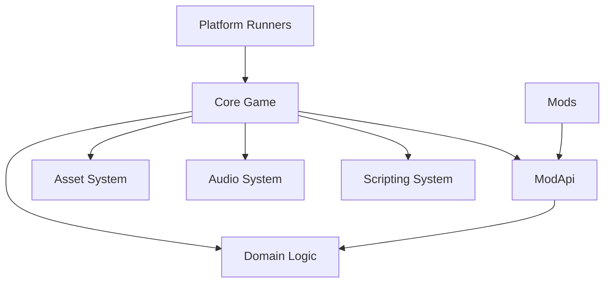
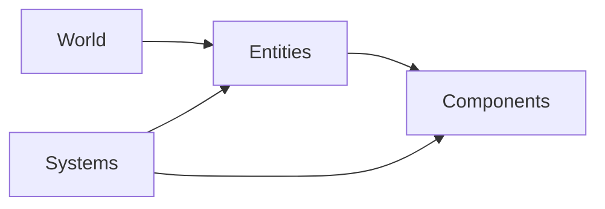
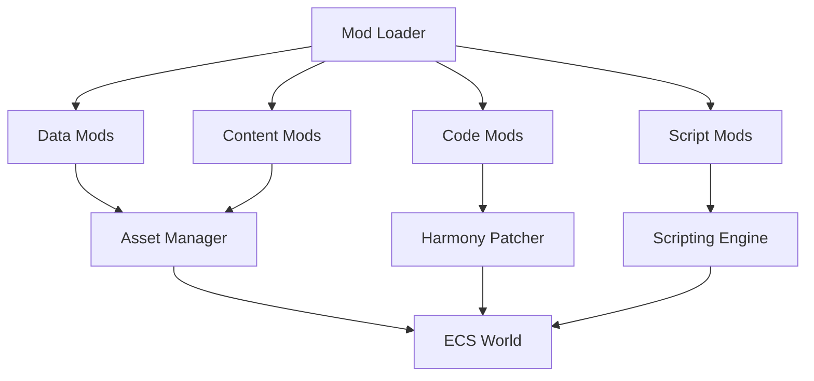
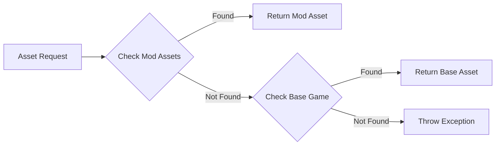

# PokeNET Architecture Overview

## Introduction

PokeNET is designed as a flexible, moddable framework for creating Pokémon-style games. The architecture emphasizes clean code principles, modularity, and extensibility.

## High-Level Architecture



## Architecture Layers

### 1. Platform Layer
**Projects**: `PokeNET.DesktopGL`, `PokeNET.WindowsDX`

- Platform-specific entry points
- Dependency injection bootstrap
- Host configuration
- Content pipeline integration
- Platform-specific packaging

**Responsibilities**:
- Initialize the Generic Host
- Configure logging and services
- Create and run the game instance
- Handle platform-specific setup

### 2. Core Layer
**Project**: `PokeNET.Core`

- Cross-platform game logic
- MonoGame integration
- ECS world management
- Rendering pipeline
- Input handling

**Responsibilities**:
- Game loop (Update/Draw)
- System orchestration
- Graphics rendering
- Input processing
- Asset loading coordination

### 3. Domain Layer
**Project**: `PokeNET.Domain`

- Pure domain models
- ECS contracts and abstractions
- Data transfer objects (DTOs)
- Utilities and helpers
- No external dependencies

**Responsibilities**:
- Define core game concepts
- Business logic
- Data structures
- Validation rules

### 4. ModApi Layer
**Project**: `PokeNET.ModApi`

- Stable, versioned mod interfaces
- Minimal API surface
- Published as NuGet package
- Semantic versioning

**Responsibilities**:
- Expose safe APIs to mods
- Version compatibility
- Documentation for modders
- Backward compatibility

### 5. Extension Modules (Optional)

#### PokeNET.Scripting
- Roslyn C# scripting host
- Script compilation and execution
- Security sandboxing
- API surface for scripts

#### PokeNET.Audio
- DryWetMidi integration
- Procedural music generation
- Audio playback management
- Sound effect system

#### PokeNET.Assets
- Advanced asset pipeline
- Asset hot-reloading
- Mod asset resolution
- Asset caching

## Dependency Flow

```
Platform Runners ─┬─> Core
                  ├─> ModApi
                  ├─> Scripting (optional)
                  ├─> Audio (optional)
                  └─> Assets (optional)

Core ────────────┬─> Domain
                 ├─> Assets (optional)
                 └─> Audio (optional)

ModApi ──────────> Domain

Scripting/Audio/Assets ─┬─> Domain
                        └─> ModApi

Mods ────────────> ModApi (ONLY)
```

**Key Principles**:
- No circular dependencies
- Dependencies flow inward toward Domain
- Mods only reference ModApi
- Domain has zero external dependencies

## Entity-Component-System (ECS)

PokeNET uses the Arch ECS library for high-performance entity management.

### ECS Architecture



### Components
**Data-only structures** that represent aspects of game entities:
- `Position`: Spatial location
- `Sprite`: Visual representation
- `Health`: Hit points and status
- `Stats`: Creature attributes
- `Velocity`: Movement data

### Systems
**Logic processors** that operate on entities with specific components:
- `MovementSystem`: Handles entity movement
- `RenderSystem`: Draws sprites to screen
- `BattleSystem`: Manages combat logic
- `AISystem`: Controls NPC behavior

### World
The **container** for all entities, components, and systems:
- Created at game startup
- Manages entity lifecycle
- Executes systems in order
- Provides querying capabilities

## Modding Architecture



### Mod Types

1. **Data Mods** (JSON/XML)
   - Define new creatures, moves, items
   - Override existing data
   - No code required

2. **Content Mods** (Assets)
   - Custom sprites, textures
   - Audio files
   - Replace base game assets

3. **Code Mods** (DLLs + Harmony)
   - Runtime code patching
   - Deep game modifications
   - Access to full Harmony API

4. **Script Mods** (C# Scripts)
   - Roslyn-compiled scripts
   - Sandboxed execution
   - Controlled API access

## Dependency Injection

PokeNET uses Microsoft.Extensions.DependencyInjection for inversion of control.

### Service Registration

```csharp
// In Program.cs (Platform Runners)
var host = Host.CreateDefaultBuilder()
    .ConfigureServices((context, services) =>
    {
        // Core services
        services.AddSingleton<IAssetManager, AssetManager>();
        services.AddSingleton<IAudioManager, AudioManager>();
        services.AddSingleton<IModLoader, ModLoader>();
        services.AddSingleton<IScriptingEngine, ScriptingEngine>();

        // ECS
        services.AddSingleton<World>(sp => World.Create());
        services.AddTransient<ISystem, MovementSystem>();
        services.AddTransient<ISystem, RenderSystem>();

        // Game instance
        services.AddSingleton<PokeNETGame>();
    })
    .Build();
```

### Service Consumption

```csharp
public class MovementSystem : ISystem
{
    private readonly ILogger<MovementSystem> _logger;
    private readonly World _world;

    // Dependencies injected via constructor
    public MovementSystem(
        ILogger<MovementSystem> logger,
        World world)
    {
        _logger = logger;
        _world = world;
    }
}
```

## Configuration System

Layered configuration using Microsoft.Extensions.Configuration:

1. **Default Configuration** (appsettings.json)
2. **User Settings** (user-settings.json)
3. **Mod Settings** (per-mod config)

### Configuration Hierarchy

```
Base Game Defaults
    ↓
User Overrides
    ↓
Mod Overrides (sorted by load order)
    ↓
Final Configuration
```

## Asset System

### Asset Resolution Order



### Asset Types
- Textures (PNG, JPG)
- Audio (WAV, OGG, MIDI)
- Data (JSON, XML)
- Scripts (CS, CSX)
- Fonts (TTF, OTF)

## Threading Model

### Main Thread
- Game loop (Update/Draw)
- ECS system execution
- Input processing
- Rendering

### Worker Threads
- Asset loading
- Script compilation
- Audio generation
- Background processing

### Synchronization
- Frame boundaries for hot reload
- Thread-safe asset caching
- Job system for parallel work
- Lock-free data structures where possible

## Performance Considerations

### Object Pooling
- Component pools for frequently created/destroyed entities
- Struct-based components to reduce heap allocations
- Reusable buffer pools

### Memory Management
- Defined memory budgets per subsystem
- Asset unloading for unused resources
- GC pressure monitoring
- Value types for hot paths

### Async Loading
- Background asset loading with progress reporting
- Cancellation token support
- Loading screens
- Asset streaming for large maps

## Error Handling

### Logging Levels
- **Trace**: Detailed execution flow
- **Debug**: Development diagnostics
- **Information**: General application flow
- **Warning**: Recoverable issues
- **Error**: Unhandled errors
- **Critical**: Application crashes

### Error Boundaries
- System-level error isolation
- Graceful degradation
- Mod error containment
- Crash reporting

## Next Steps

- [SOLID Principles Implementation](solid-principles.md)
- [Design Patterns](design-patterns.md)
- [Project Structure](project-structure.md)
- [ECS Architecture Deep Dive](ecs-architecture.md)

---

*Last Updated: 2025-10-22*
