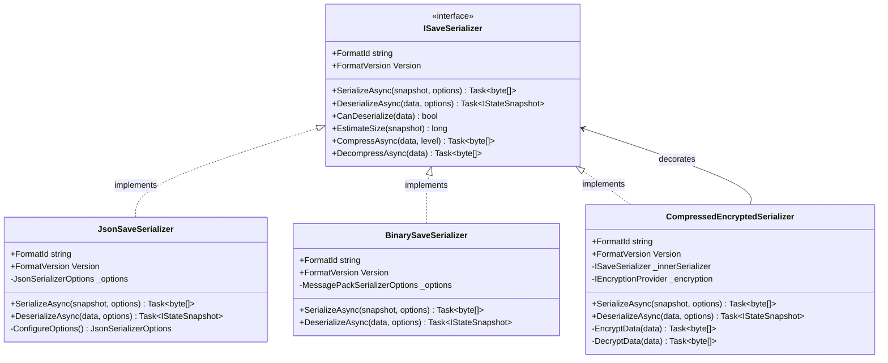

# Game State and Save System Architecture

## Executive Summary

This document defines the comprehensive, SOLID-compliant architecture for PokeNET's Game State and Save System. The system is designed to provide reliable, extensible, and performant save/load functionality while maintaining compatibility with the ECS architecture and modding system.

## Table of Contents

1. [Architecture Overview](#architecture-overview)
2. [Core Interfaces](#core-interfaces)
3. [Architecture Patterns](#architecture-patterns)
4. [Data Flow](#data-flow)
5. [Class Diagrams](#class-diagrams)
6. [Sequence Diagrams](#sequence-diagrams)
7. [Integration Points](#integration-points)
8. [Error Handling Strategy](#error-handling-strategy)
9. [SOLID Compliance](#solid-compliance)
10. [Implementation Roadmap](#implementation-roadmap)

---

## Architecture Overview

### High-Level Component Diagram


### Design Principles

1. **Separation of Concerns**: Save orchestration, state management, serialization, and file I/O are separate responsibilities
2. **Dependency Inversion**: All components depend on abstractions, not concrete implementations
3. **Strategy Pattern**: Multiple serialization formats supported through strategy interface
4. **Repository Pattern**: Data access abstracted behind repository interface
5. **Memento Pattern**: State snapshots captured and restored without exposing internals
6. **Observer Pattern**: Auto-save and event notifications through observer pattern
7. **Unit of Work**: Transactional saves with rollback capability

---

## Core Interfaces

### 1. ISaveSystem - Main Orchestration Interface

**Responsibility**: Coordinate the entire save/load process

```csharp
namespace PokeNET.Domain.Persistence;

/// <summary>
/// Main save system orchestrator following the Facade pattern.
/// Coordinates state management, serialization, validation, and file I/O.
/// </summary>
/// <remarks>
/// SOLID Principles:
/// - SRP: Single responsibility - orchestrate save/load operations
/// - OCP: Open for extension through strategies and providers
/// - DIP: Depends on abstractions (IGameStateManager, ISaveSerializer, etc.)
/// </remarks>
public interface ISaveSystem
{
    /// <summary>
    /// Saves the current game state to the specified slot.
    /// </summary>
    /// <param name="slotId">The save slot identifier (0-based index or named slot)</param>
    /// <param name="metadata">Optional metadata for the save file</param>
    /// <param name="cancellationToken">Cancellation token for async operation</param>
    /// <returns>Result indicating success/failure with diagnostics</returns>
    Task<SaveResult> SaveGameAsync(
        string slotId,
        SaveMetadata? metadata = null,
        CancellationToken cancellationToken = default);

    /// <summary>
    /// Loads game state from the specified slot.
    /// </summary>
    /// <param name="slotId">The save slot identifier</param>
    /// <param name="cancellationToken">Cancellation token for async operation</param>
    /// <returns>Result containing loaded state or error information</returns>
    Task<LoadResult> LoadGameAsync(
        string slotId,
        CancellationToken cancellationToken = default);

    /// <summary>
    /// Performs an auto-save operation.
    /// </summary>
    /// <param name="cancellationToken">Cancellation token</param>
    /// <returns>Result of the auto-save operation</returns>
    Task<SaveResult> AutoSaveAsync(CancellationToken cancellationToken = default);

    /// <summary>
    /// Deletes a save file from the specified slot.
    /// </summary>
    /// <param name="slotId">The save slot identifier</param>
    /// <returns>True if deletion succeeded, false otherwise</returns>
    Task<bool> DeleteSaveAsync(string slotId);

    /// <summary>
    /// Lists all available save slots with metadata.
    /// </summary>
    /// <returns>Collection of save slot information</returns>
    Task<IReadOnlyList<SaveSlotInfo>> ListSaveSlotsAsync();

    /// <summary>
    /// Exports a save file to an external location (for backup/sharing).
    /// </summary>
    /// <param name="slotId">The save slot to export</param>
    /// <param name="exportPath">Destination path for the export</param>
    /// <param name="cancellationToken">Cancellation token</param>
    /// <returns>Result of the export operation</returns>
    Task<ExportResult> ExportSaveAsync(
        string slotId,
        string exportPath,
        CancellationToken cancellationToken = default);

    /// <summary>
    /// Imports a save file from an external location.
    /// </summary>
    /// <param name="importPath">Source path for the import</param>
    /// <param name="targetSlotId">Destination slot ID</param>
    /// <param name="cancellationToken">Cancellation token</param>
    /// <returns>Result of the import operation</returns>
    Task<ImportResult> ImportSaveAsync(
        string importPath,
        string targetSlotId,
        CancellationToken cancellationToken = default);

    /// <summary>
    /// Verifies the integrity of a save file.
    /// </summary>
    /// <param name="slotId">The save slot to verify</param>
    /// <returns>Validation result with detailed diagnostics</returns>
    Task<ValidationResult> VerifySaveIntegrityAsync(string slotId);

    /// <summary>
    /// Event raised before a save operation begins.
    /// </summary>
    event EventHandler<SaveEventArgs>? SavingGame;

    /// <summary>
    /// Event raised after a save operation completes.
    /// </summary>
    event EventHandler<SaveEventArgs>? GameSaved;

    /// <summary>
    /// Event raised before a load operation begins.
    /// </summary>
    event EventHandler<LoadEventArgs>? LoadingGame;

    /// <summary>
    /// Event raised after a load operation completes.
    /// </summary>
    event EventHandler<LoadEventArgs>? GameLoaded;
}
```

### 2. IGameStateManager - State Snapshot Management

**Responsibility**: Create and restore game state snapshots (Memento pattern)

```csharp
namespace PokeNET.Domain.Persistence;

/// <summary>
/// Manages game state snapshots using the Memento pattern.
/// Captures complete game state without exposing internal structure.
/// </summary>
/// <remarks>
/// SOLID Principles:
/// - SRP: Responsible only for state snapshot management
/// - ISP: Focused interface for state operations only
/// - DIP: Depends on abstractions (IStateSnapshot, IWorldSerializer)
/// </remarks>
public interface IGameStateManager
{
    /// <summary>
    /// Creates a snapshot of the current game state.
    /// </summary>
    /// <param name="includeModData">Whether to include mod-specific data</param>
    /// <returns>Immutable state snapshot</returns>
    Task<IStateSnapshot> CaptureStateAsync(bool includeModData = true);

    /// <summary>
    /// Restores game state from a snapshot.
    /// </summary>
    /// <param name="snapshot">The state snapshot to restore</param>
    /// <param name="cancellationToken">Cancellation token</param>
    /// <returns>Result indicating success or failure</returns>
    Task<RestoreResult> RestoreStateAsync(
        IStateSnapshot snapshot,
        CancellationToken cancellationToken = default);

    /// <summary>
    /// Creates a differential snapshot (only changes since last snapshot).
    /// </summary>
    /// <param name="baseSnapshot">The base snapshot to compare against</param>
    /// <returns>Delta snapshot containing only changes</returns>
    Task<IStateSnapshot> CaptureDeltaAsync(IStateSnapshot baseSnapshot);

    /// <summary>
    /// Merges a delta snapshot with a base snapshot.
    /// </summary>
    /// <param name="baseSnapshot">The base snapshot</param>
    /// <param name="deltaSnapshot">The delta to apply</param>
    /// <returns>Merged complete snapshot</returns>
    Task<IStateSnapshot> MergeDeltaAsync(
        IStateSnapshot baseSnapshot,
        IStateSnapshot deltaSnapshot);

    /// <summary>
    /// Validates that a snapshot can be restored to the current game version.
    /// </summary>
    /// <param name="snapshot">The snapshot to validate</param>
    /// <returns>Validation result</returns>
    Task<ValidationResult> ValidateSnapshotCompatibilityAsync(IStateSnapshot snapshot);

    /// <summary>
    /// Gets the current game state metadata without creating a full snapshot.
    /// </summary>
    /// <returns>Lightweight state metadata</returns>
    GameStateMetadata GetCurrentMetadata();
}
```

### 3. ISaveFileProvider - File I/O Abstraction

**Responsibility**: Handle all file system operations

```csharp
namespace PokeNET.Domain.Persistence;

/// <summary>
/// Abstracts file system operations for save files.
/// Enables testing and alternative storage backends (cloud, embedded, etc.).
/// </summary>
/// <remarks>
/// SOLID Principles:
/// - SRP: Only responsible for file I/O operations
/// - OCP: Can be extended with different storage implementations
/// - LSP: All implementations must honor the contract
/// </remarks>
public interface ISaveFileProvider
{
    /// <summary>
    /// Writes save data to storage.
    /// </summary>
    /// <param name="slotId">The save slot identifier</param>
    /// <param name="data">The serialized save data</param>
    /// <param name="cancellationToken">Cancellation token</param>
    /// <returns>Result indicating success or failure</returns>
    Task<WriteResult> WriteAsync(
        string slotId,
        ReadOnlyMemory<byte> data,
        CancellationToken cancellationToken = default);

    /// <summary>
    /// Reads save data from storage.
    /// </summary>
    /// <param name="slotId">The save slot identifier</param>
    /// <param name="cancellationToken">Cancellation token</param>
    /// <returns>The raw save data or null if not found</returns>
    Task<ReadOnlyMemory<byte>?> ReadAsync(
        string slotId,
        CancellationToken cancellationToken = default);

    /// <summary>
    /// Deletes a save file from storage.
    /// </summary>
    /// <param name="slotId">The save slot identifier</param>
    /// <returns>True if deleted successfully</returns>
    Task<bool> DeleteAsync(string slotId);

    /// <summary>
    /// Checks if a save file exists.
    /// </summary>
    /// <param name="slotId">The save slot identifier</param>
    /// <returns>True if the save exists</returns>
    Task<bool> ExistsAsync(string slotId);

    /// <summary>
    /// Lists all available save slots.
    /// </summary>
    /// <returns>Collection of slot identifiers</returns>
    Task<IReadOnlyList<string>> ListSlotsAsync();

    /// <summary>
    /// Gets metadata about a save file without loading the entire file.
    /// </summary>
    /// <param name="slotId">The save slot identifier</param>
    /// <returns>File metadata or null if not found</returns>
    Task<SaveFileMetadata?> GetMetadataAsync(string slotId);

    /// <summary>
    /// Creates a backup of a save file.
    /// </summary>
    /// <param name="slotId">The save slot to backup</param>
    /// <param name="backupName">Optional backup name</param>
    /// <returns>The backup identifier</returns>
    Task<string> CreateBackupAsync(string slotId, string? backupName = null);

    /// <summary>
    /// Restores a save file from a backup.
    /// </summary>
    /// <param name="backupId">The backup identifier</param>
    /// <param name="targetSlotId">The target slot to restore to</param>
    /// <returns>True if restore succeeded</returns>
    Task<bool> RestoreBackupAsync(string backupId, string targetSlotId);

    /// <summary>
    /// Gets the total size of all save files.
    /// </summary>
    /// <returns>Total size in bytes</returns>
    Task<long> GetTotalSizeBytesAsync();

    /// <summary>
    /// Validates storage health and available space.
    /// </summary>
    /// <returns>Storage health information</returns>
    Task<StorageHealth> CheckHealthAsync();
}
```

### 4. ISaveSerializer - Serialization Strategy

**Responsibility**: Serialize/deserialize game state (Strategy pattern)

```csharp
namespace PokeNET.Domain.Persistence;

/// <summary>
/// Defines the strategy for serializing and deserializing game state.
/// Supports multiple formats (JSON, Binary, MessagePack, etc.).
/// </summary>
/// <remarks>
/// SOLID Principles:
/// - SRP: Only responsible for serialization/deserialization
/// - OCP: New formats can be added without modifying existing code
/// - LSP: All serializers must be interchangeable
/// </remarks>
public interface ISaveSerializer
{
    /// <summary>
    /// Gets the format identifier for this serializer.
    /// </summary>
    string FormatId { get; }

    /// <summary>
    /// Gets the version of the serialization format.
    /// </summary>
    Version FormatVersion { get; }

    /// <summary>
    /// Serializes a state snapshot to bytes.
    /// </summary>
    /// <param name="snapshot">The snapshot to serialize</param>
    /// <param name="options">Serialization options</param>
    /// <returns>Serialized data</returns>
    Task<ReadOnlyMemory<byte>> SerializeAsync(
        IStateSnapshot snapshot,
        SerializationOptions? options = null);

    /// <summary>
    /// Deserializes bytes to a state snapshot.
    /// </summary>
    /// <param name="data">The serialized data</param>
    /// <param name="options">Deserialization options</param>
    /// <returns>Deserialized snapshot</returns>
    Task<IStateSnapshot> DeserializeAsync(
        ReadOnlyMemory<byte> data,
        SerializationOptions? options = null);

    /// <summary>
    /// Validates that data can be deserialized by this serializer.
    /// </summary>
    /// <param name="data">The data to validate</param>
    /// <returns>True if data is compatible</returns>
    bool CanDeserialize(ReadOnlyMemory<byte> data);

    /// <summary>
    /// Gets estimated serialized size for a snapshot (for progress reporting).
    /// </summary>
    /// <param name="snapshot">The snapshot to estimate</param>
    /// <returns>Estimated size in bytes</returns>
    long EstimateSize(IStateSnapshot snapshot);

    /// <summary>
    /// Compresses serialized data.
    /// </summary>
    /// <param name="data">Data to compress</param>
    /// <param name="compressionLevel">Compression level (0-9)</param>
    /// <returns>Compressed data</returns>
    Task<ReadOnlyMemory<byte>> CompressAsync(
        ReadOnlyMemory<byte> data,
        int compressionLevel = 6);

    /// <summary>
    /// Decompresses serialized data.
    /// </summary>
    /// <param name="compressedData">Compressed data</param>
    /// <returns>Decompressed data</returns>
    Task<ReadOnlyMemory<byte>> DecompressAsync(ReadOnlyMemory<byte> compressedData);
}
```

### 5. ISaveValidator - Data Integrity Validation

**Responsibility**: Validate save data integrity

```csharp
namespace PokeNET.Domain.Persistence;

/// <summary>
/// Validates save data integrity, checksums, and compatibility.
/// </summary>
/// <remarks>
/// SOLID Principles:
/// - SRP: Only responsible for validation logic
/// - ISP: Focused interface for validation operations
/// </remarks>
public interface ISaveValidator
{
    /// <summary>
    /// Validates a state snapshot before saving.
    /// </summary>
    /// <param name="snapshot">The snapshot to validate</param>
    /// <returns>Validation result with detailed diagnostics</returns>
    Task<ValidationResult> ValidateBeforeSaveAsync(IStateSnapshot snapshot);

    /// <summary>
    /// Validates serialized data after loading.
    /// </summary>
    /// <param name="data">The serialized data</param>
    /// <returns>Validation result</returns>
    Task<ValidationResult> ValidateAfterLoadAsync(ReadOnlyMemory<byte> data);

    /// <summary>
    /// Verifies the checksum of save data.
    /// </summary>
    /// <param name="data">The data to verify</param>
    /// <param name="expectedChecksum">The expected checksum</param>
    /// <returns>True if checksum matches</returns>
    bool VerifyChecksum(ReadOnlyMemory<byte> data, string expectedChecksum);

    /// <summary>
    /// Calculates checksum for save data.
    /// </summary>
    /// <param name="data">The data to checksum</param>
    /// <returns>Checksum string</returns>
    string CalculateChecksum(ReadOnlyMemory<byte> data);

    /// <summary>
    /// Validates mod compatibility for a snapshot.
    /// </summary>
    /// <param name="snapshot">The snapshot to check</param>
    /// <param name="loadedMods">Currently loaded mods</param>
    /// <returns>Compatibility result with warnings</returns>
    Task<CompatibilityResult> ValidateModCompatibilityAsync(
        IStateSnapshot snapshot,
        IReadOnlyList<ModManifest> loadedMods);

    /// <summary>
    /// Checks for data corruption in a snapshot.
    /// </summary>
    /// <param name="snapshot">The snapshot to check</param>
    /// <returns>Corruption check result</returns>
    Task<CorruptionCheckResult> CheckForCorruptionAsync(IStateSnapshot snapshot);

    /// <summary>
    /// Validates that required game data exists for a snapshot.
    /// </summary>
    /// <param name="snapshot">The snapshot to validate</param>
    /// <returns>Validation result indicating missing data</returns>
    Task<ValidationResult> ValidateRequiredDataAsync(IStateSnapshot snapshot);
}
```

### 6. ISaveMigrator - Version Migration

**Responsibility**: Migrate save data between game versions

```csharp
namespace PokeNET.Domain.Persistence;

/// <summary>
/// Handles migration of save data between different game versions.
/// </summary>
/// <remarks>
/// SOLID Principles:
/// - SRP: Only responsible for version migration
/// - OCP: New migrations can be added without modifying existing ones
/// </remarks>
public interface ISaveMigrator
{
    /// <summary>
    /// Gets the current save format version.
    /// </summary>
    Version CurrentVersion { get; }

    /// <summary>
    /// Checks if a snapshot needs migration.
    /// </summary>
    /// <param name="snapshot">The snapshot to check</param>
    /// <returns>True if migration is needed</returns>
    bool RequiresMigration(IStateSnapshot snapshot);

    /// <summary>
    /// Migrates a snapshot to the current version.
    /// </summary>
    /// <param name="snapshot">The snapshot to migrate</param>
    /// <param name="progress">Progress reporter for multi-step migrations</param>
    /// <returns>Migrated snapshot</returns>
    Task<MigrationResult> MigrateAsync(
        IStateSnapshot snapshot,
        IProgress<MigrationProgress>? progress = null);

    /// <summary>
    /// Gets available migration path from a version to current.
    /// </summary>
    /// <param name="fromVersion">Source version</param>
    /// <returns>List of migration steps required</returns>
    IReadOnlyList<MigrationStep> GetMigrationPath(Version fromVersion);

    /// <summary>
    /// Validates that a migration is safe to perform.
    /// </summary>
    /// <param name="snapshot">The snapshot to migrate</param>
    /// <returns>Safety check result</returns>
    Task<MigrationSafetyResult> ValidateMigrationSafetyAsync(IStateSnapshot snapshot);

    /// <summary>
    /// Registers a custom migration step.
    /// </summary>
    /// <param name="fromVersion">Source version</param>
    /// <param name="toVersion">Target version</param>
    /// <param name="migrator">Migration function</param>
    void RegisterMigration(
        Version fromVersion,
        Version toVersion,
        Func<IStateSnapshot, Task<IStateSnapshot>> migrator);

    /// <summary>
    /// Creates a backup before attempting migration.
    /// </summary>
    /// <param name="snapshot">The snapshot to backup</param>
    /// <returns>Backup identifier</returns>
    Task<string> CreateMigrationBackupAsync(IStateSnapshot snapshot);
}
```

---

## Architecture Patterns

### 1. Repository Pattern

**Purpose**: Abstract data access and provide a collection-like interface

```csharp
namespace PokeNET.Domain.Persistence;

/// <summary>
/// Repository for save game data following the Repository pattern.
/// Provides a collection-like interface for save operations.
/// </summary>
public interface ISaveRepository
{
    /// <summary>
    /// Gets a save by slot identifier.
    /// </summary>
    Task<SaveData?> GetBySlotAsync(string slotId);

    /// <summary>
    /// Adds or updates a save.
    /// </summary>
    Task AddOrUpdateAsync(string slotId, SaveData saveData);

    /// <summary>
    /// Removes a save.
    /// </summary>
    Task<bool> RemoveAsync(string slotId);

    /// <summary>
    /// Gets all available saves.
    /// </summary>
    Task<IReadOnlyList<SaveData>> GetAllAsync();

    /// <summary>
    /// Queries saves by predicate.
    /// </summary>
    Task<IReadOnlyList<SaveData>> QueryAsync(
        Expression<Func<SaveData, bool>> predicate);

    /// <summary>
    /// Gets the most recent save.
    /// </summary>
    Task<SaveData?> GetMostRecentAsync();

    /// <summary>
    /// Gets saves created within a time range.
    /// </summary>
    Task<IReadOnlyList<SaveData>> GetByDateRangeAsync(
        DateTime startDate,
        DateTime endDate);
}
```

### 2. Unit of Work Pattern

**Purpose**: Maintain transactional integrity across save operations

```csharp
namespace PokeNET.Domain.Persistence;

/// <summary>
/// Unit of Work pattern for transactional save operations.
/// Ensures all-or-nothing semantics for complex saves.
/// </summary>
public interface IUnitOfWork : IDisposable
{
    /// <summary>
    /// Gets the save repository for this unit of work.
    /// </summary>
    ISaveRepository Saves { get; }

    /// <summary>
    /// Begins a new transaction.
    /// </summary>
    void BeginTransaction();

    /// <summary>
    /// Commits all changes made in this unit of work.
    /// </summary>
    Task<bool> CommitAsync();

    /// <summary>
    /// Rolls back all changes made in this unit of work.
    /// </summary>
    Task RollbackAsync();

    /// <summary>
    /// Gets whether this unit of work is in a transaction.
    /// </summary>
    bool IsInTransaction { get; }

    /// <summary>
    /// Creates a savepoint within the current transaction.
    /// </summary>
    Task<string> CreateSavepointAsync(string name);

    /// <summary>
    /// Rolls back to a specific savepoint.
    /// </summary>
    Task RollbackToSavepointAsync(string savepointId);
}
```

### 3. Strategy Pattern (Serialization)

**Purpose**: Interchangeable serialization algorithms

```csharp
namespace PokeNET.Domain.Persistence.Serializers;

/// <summary>
/// JSON serialization strategy using System.Text.Json.
/// </summary>
public class JsonSaveSerializer : ISaveSerializer
{
    public string FormatId => "JSON";
    public Version FormatVersion => new Version(1, 0, 0);

    // Implementation details...
}

/// <summary>
/// Binary serialization strategy using MessagePack.
/// </summary>
public class BinarySaveSerializer : ISaveSerializer
{
    public string FormatId => "MSGPACK";
    public Version FormatVersion => new Version(1, 0, 0);

    // Implementation details...
}

/// <summary>
/// Compressed binary serialization with encryption support.
/// </summary>
public class CompressedEncryptedSerializer : ISaveSerializer
{
    public string FormatId => "COMPRESSED_ENCRYPTED";
    public Version FormatVersion => new Version(1, 0, 0);

    // Implementation details...
}
```

### 4. Observer Pattern (Auto-Save)

**Purpose**: Trigger saves based on game events

```csharp
namespace PokeNET.Domain.Persistence;

/// <summary>
/// Observes game events and triggers auto-save when appropriate.
/// </summary>
public interface IAutoSaveManager
{
    /// <summary>
    /// Starts monitoring for auto-save conditions.
    /// </summary>
    void Start();

    /// <summary>
    /// Stops monitoring for auto-save conditions.
    /// </summary>
    void Stop();

    /// <summary>
    /// Configures auto-save triggers.
    /// </summary>
    void Configure(AutoSaveConfiguration config);

    /// <summary>
    /// Manually triggers an auto-save.
    /// </summary>
    Task TriggerAutoSaveAsync();

    /// <summary>
    /// Event raised when an auto-save is about to occur.
    /// </summary>
    event EventHandler<AutoSaveEventArgs>? AutoSaving;

    /// <summary>
    /// Event raised when an auto-save completes.
    /// </summary>
    event EventHandler<AutoSaveEventArgs>? AutoSaveCompleted;
}

/// <summary>
/// Auto-save configuration.
/// </summary>
public class AutoSaveConfiguration
{
    /// <summary>
    /// Enable time-based auto-save.
    /// </summary>
    public bool EnableTimeBased { get; set; }

    /// <summary>
    /// Interval in minutes for time-based auto-save.
    /// </summary>
    public int IntervalMinutes { get; set; } = 5;

    /// <summary>
    /// Enable event-based auto-save.
    /// </summary>
    public bool EnableEventBased { get; set; }

    /// <summary>
    /// Events that should trigger auto-save.
    /// </summary>
    public HashSet<string> TriggerEvents { get; set; } = new()
    {
        "BattleCompleted",
        "LevelUp",
        "ItemAcquired",
        "LocationChanged"
    };

    /// <summary>
    /// Maximum number of auto-save slots to maintain.
    /// </summary>
    public int MaxAutoSaveSlots { get; set; } = 3;

    /// <summary>
    /// Enable rotating auto-save slots.
    /// </summary>
    public bool RotateSlots { get; set; } = true;
}
```

### 5. Memento Pattern (State Snapshots)

**Purpose**: Capture and restore object state without violating encapsulation

```csharp
namespace PokeNET.Domain.Persistence;

/// <summary>
/// Represents an immutable snapshot of game state (Memento pattern).
/// </summary>
public interface IStateSnapshot
{
    /// <summary>
    /// Gets the unique identifier for this snapshot.
    /// </summary>
    Guid SnapshotId { get; }

    /// <summary>
    /// Gets the game version that created this snapshot.
    /// </summary>
    Version GameVersion { get; }

    /// <summary>
    /// Gets the save format version.
    /// </summary>
    Version FormatVersion { get; }

    /// <summary>
    /// Gets the timestamp when this snapshot was created.
    /// </summary>
    DateTime CreatedAt { get; }

    /// <summary>
    /// Gets the snapshot metadata.
    /// </summary>
    SnapshotMetadata Metadata { get; }

    /// <summary>
    /// Gets the ECS world state data.
    /// </summary>
    WorldStateData WorldState { get; }

    /// <summary>
    /// Gets the player progress data.
    /// </summary>
    PlayerProgressData PlayerProgress { get; }

    /// <summary>
    /// Gets mod-specific data.
    /// </summary>
    IReadOnlyDictionary<string, object> ModData { get; }

    /// <summary>
    /// Gets the checksum for integrity verification.
    /// </summary>
    string Checksum { get; }

    /// <summary>
    /// Creates a deep clone of this snapshot.
    /// </summary>
    IStateSnapshot Clone();

    /// <summary>
    /// Gets the estimated size of this snapshot in bytes.
    /// </summary>
    long EstimatedSizeBytes { get; }
}
```

---

## Data Flow

### Save Flow Diagram


### Load Flow Diagram


### Auto-Save Flow Diagram


---

## Class Diagrams

### Core Save System Classes


### Serialization Strategy Classes



### Repository and Unit of Work Classes


---

## Integration Points

### 1. ECS (Arch) Integration

**Challenge**: Serialize/deserialize an Arch ECS World without exposing internals

**Solution**: World Serialization Service

```csharp
namespace PokeNET.Domain.Persistence.ECS;

/// <summary>
/// Handles serialization of Arch ECS World state.
/// </summary>
public interface IWorldSerializer
{
    /// <summary>
    /// Captures the current state of the ECS world.
    /// </summary>
    /// <param name="world">The Arch world to serialize</param>
    /// <returns>Serializable world state data</returns>
    Task<WorldStateData> CaptureWorldAsync(World world);

    /// <summary>
    /// Restores a world from serialized state.
    /// </summary>
    /// <param name="world">The target world to restore into</param>
    /// <param name="stateData">The state data to restore</param>
    /// <returns>Restore result</returns>
    Task<RestoreResult> RestoreWorldAsync(World world, WorldStateData stateData);

    /// <summary>
    /// Registers a component serializer for a specific component type.
    /// </summary>
    /// <typeparam name="T">Component type</typeparam>
    /// <param name="serializer">Component serializer</param>
    void RegisterComponentSerializer<T>(IComponentSerializer<T> serializer) where T : struct;
}

/// <summary>
/// Serializable representation of ECS world state.
/// </summary>
public class WorldStateData
{
    /// <summary>
    /// Entity data grouped by archetype.
    /// </summary>
    public Dictionary<string, ArchetypeData> Archetypes { get; set; } = new();

    /// <summary>
    /// Total entity count.
    /// </summary>
    public int EntityCount { get; set; }

    /// <summary>
    /// Archetype count.
    /// </summary>
    public int ArchetypeCount { get; set; }

    /// <summary>
    /// Component type registry.
    /// </summary>
    public Dictionary<string, ComponentTypeInfo> ComponentTypes { get; set; } = new();
}

/// <summary>
/// Data for a specific archetype.
/// </summary>
public class ArchetypeData
{
    /// <summary>
    /// Archetype identifier (component signature hash).
    /// </summary>
    public string ArchetypeId { get; set; } = string.Empty;

    /// <summary>
    /// Component types in this archetype.
    /// </summary>
    public List<string> ComponentTypes { get; set; } = new();

    /// <summary>
    /// Entities in this archetype.
    /// </summary>
    public List<EntityData> Entities { get; set; } = new();
}

/// <summary>
/// Data for a single entity.
/// </summary>
public class EntityData
{
    /// <summary>
    /// Entity ID.
    /// </summary>
    public int EntityId { get; set; }

    /// <summary>
    /// Component data indexed by type name.
    /// </summary>
    public Dictionary<string, object> Components { get; set; } = new();
}

/// <summary>
/// Serializer for a specific component type.
/// </summary>
public interface IComponentSerializer<T> where T : struct
{
    /// <summary>
    /// Serializes a component to a dictionary.
    /// </summary>
    Dictionary<string, object> Serialize(in T component);

    /// <summary>
    /// Deserializes a component from a dictionary.
    /// </summary>
    T Deserialize(Dictionary<string, object> data);
}
```

**Integration Flow**:

1. `GameStateManager` requests `IWorldSerializer` to capture ECS world
2. `WorldSerializer` iterates through archetypes and entities
3. Each component type uses registered `IComponentSerializer<T>` for serialization
4. Resulting `WorldStateData` is stored in `IStateSnapshot`
5. On load, process reverses: `WorldStateData` → `IComponentSerializer<T>` → ECS World

### 2. Modding System Integration

**Challenge**: Allow mods to save custom data without breaking save compatibility

**Solution**: Mod Data Registry and Versioned Schemas

```csharp
namespace PokeNET.Domain.Persistence.Modding;

/// <summary>
/// Registry for mod-specific save data.
/// </summary>
public interface IModDataRegistry
{
    /// <summary>
    /// Registers a mod's save data schema.
    /// </summary>
    /// <param name="modId">Mod identifier</param>
    /// <param name="schema">Save data schema</param>
    void RegisterModSchema(string modId, ModDataSchema schema);

    /// <summary>
    /// Captures save data from all registered mods.
    /// </summary>
    /// <returns>Dictionary of mod ID to save data</returns>
    Task<Dictionary<string, object>> CaptureModDataAsync();

    /// <summary>
    /// Restores save data to all registered mods.
    /// </summary>
    /// <param name="modData">Dictionary of mod ID to save data</param>
    /// <returns>Restore result per mod</returns>
    Task<Dictionary<string, RestoreResult>> RestoreModDataAsync(
        Dictionary<string, object> modData);

    /// <summary>
    /// Validates mod data compatibility.
    /// </summary>
    /// <param name="modData">Saved mod data</param>
    /// <param name="loadedMods">Currently loaded mods</param>
    /// <returns>Compatibility result</returns>
    Task<ModCompatibilityResult> ValidateCompatibilityAsync(
        Dictionary<string, object> modData,
        IReadOnlyList<ModManifest> loadedMods);

    /// <summary>
    /// Migrates mod data to new versions.
    /// </summary>
    /// <param name="modId">Mod identifier</param>
    /// <param name="oldData">Old version data</param>
    /// <param name="fromVersion">Source version</param>
    /// <param name="toVersion">Target version</param>
    /// <returns>Migrated data</returns>
    Task<object> MigrateModDataAsync(
        string modId,
        object oldData,
        Version fromVersion,
        Version toVersion);
}

/// <summary>
/// Schema definition for mod save data.
/// </summary>
public class ModDataSchema
{
    /// <summary>
    /// Mod identifier.
    /// </summary>
    public string ModId { get; set; } = string.Empty;

    /// <summary>
    /// Schema version.
    /// </summary>
    public Version SchemaVersion { get; set; } = new Version(1, 0, 0);

    /// <summary>
    /// Data structure definition.
    /// </summary>
    public Type DataType { get; set; } = typeof(object);

    /// <summary>
    /// Migration functions for version upgrades.
    /// </summary>
    public Dictionary<Version, Func<object, object>> Migrations { get; set; } = new();

    /// <summary>
    /// Validation function for data integrity.
    /// </summary>
    public Func<object, ValidationResult>? Validator { get; set; }
}

/// <summary>
/// Mod compatibility check result.
/// </summary>
public class ModCompatibilityResult
{
    /// <summary>
    /// Overall compatibility status.
    /// </summary>
    public CompatibilityStatus Status { get; set; }

    /// <summary>
    /// Missing mods (saved but not loaded).
    /// </summary>
    public List<string> MissingMods { get; set; } = new();

    /// <summary>
    /// Extra mods (loaded but not in save).
    /// </summary>
    public List<string> ExtraMods { get; set; } = new();

    /// <summary>
    /// Mods with version mismatches.
    /// </summary>
    public Dictionary<string, VersionMismatch> VersionMismatches { get; set; } = new();

    /// <summary>
    /// Warnings and recommendations.
    /// </summary>
    public List<string> Warnings { get; set; } = new();

    /// <summary>
    /// Whether the save can still be loaded.
    /// </summary>
    public bool CanLoad => Status != CompatibilityStatus.Incompatible;
}

public enum CompatibilityStatus
{
    FullyCompatible,
    MinorWarnings,
    MajorWarnings,
    Incompatible
}
```

### 3. Event System Integration

**Challenge**: Notify game systems of save/load events

**Solution**: Event Publishing through IEventBus

```csharp
namespace PokeNET.Domain.Persistence.Events;

/// <summary>
/// Published before a save operation.
/// </summary>
public class SaveGameEvent : IGameEvent
{
    public DateTime Timestamp { get; init; } = DateTime.UtcNow;
    public string SlotId { get; init; } = string.Empty;
    public SaveMetadata Metadata { get; init; } = new();
    public bool IsAutoSave { get; init; }
}

/// <summary>
/// Published after a successful save.
/// </summary>
public class GameSavedEvent : IGameEvent
{
    public DateTime Timestamp { get; init; } = DateTime.UtcNow;
    public string SlotId { get; init; } = string.Empty;
    public long FileSizeBytes { get; init; }
    public TimeSpan Duration { get; init; }
}

/// <summary>
/// Published before a load operation.
/// </summary>
public class LoadGameEvent : IGameEvent
{
    public DateTime Timestamp { get; init; } = DateTime.UtcNow;
    public string SlotId { get; init; } = string.Empty;
}

/// <summary>
/// Published after a successful load.
/// </summary>
public class GameLoadedEvent : IGameEvent
{
    public DateTime Timestamp { get; init; } = DateTime.UtcNow;
    public string SlotId { get; init; } = string.Empty;
    public Version SaveVersion { get; init; } = new();
    public bool WasMigrated { get; init; }
    public TimeSpan Duration { get; init; }
}

/// <summary>
/// Published when save/load fails.
/// </summary>
public class SaveLoadErrorEvent : IGameEvent
{
    public DateTime Timestamp { get; init; } = DateTime.UtcNow;
    public string Operation { get; init; } = string.Empty; // "Save" or "Load"
    public string SlotId { get; init; } = string.Empty;
    public string ErrorMessage { get; init; } = string.Empty;
    public Exception? Exception { get; init; }
}
```

### 4. Configuration System Integration

**Challenge**: Configure save system behavior through settings

**Solution**: Save System Configuration

```csharp
namespace PokeNET.Domain.Persistence.Configuration;

/// <summary>
/// Configuration for the save system.
/// </summary>
public class SaveSystemConfiguration
{
    /// <summary>
    /// Save file format to use.
    /// </summary>
    public string SerializerFormat { get; set; } = "JSON";

    /// <summary>
    /// Enable compression for save files.
    /// </summary>
    public bool EnableCompression { get; set; } = true;

    /// <summary>
    /// Compression level (0-9).
    /// </summary>
    public int CompressionLevel { get; set; } = 6;

    /// <summary>
    /// Enable encryption for save files.
    /// </summary>
    public bool EnableEncryption { get; set; } = false;

    /// <summary>
    /// Maximum number of save slots.
    /// </summary>
    public int MaxSaveSlots { get; set; } = 10;

    /// <summary>
    /// Auto-save configuration.
    /// </summary>
    public AutoSaveConfiguration AutoSave { get; set; } = new();

    /// <summary>
    /// Backup configuration.
    /// </summary>
    public BackupConfiguration Backup { get; set; } = new();

    /// <summary>
    /// Migration configuration.
    /// </summary>
    public MigrationConfiguration Migration { get; set; } = new();

    /// <summary>
    /// Save directory path (relative to game directory).
    /// </summary>
    public string SaveDirectory { get; set; } = "Saves";

    /// <summary>
    /// Enable cloud save synchronization.
    /// </summary>
    public bool EnableCloudSync { get; set; } = false;
}

/// <summary>
/// Backup configuration.
/// </summary>
public class BackupConfiguration
{
    /// <summary>
    /// Enable automatic backups before overwrites.
    /// </summary>
    public bool EnableAutoBackup { get; set; } = true;

    /// <summary>
    /// Maximum number of backups to keep per slot.
    /// </summary>
    public int MaxBackupsPerSlot { get; set; } = 3;

    /// <summary>
    /// Backup retention period in days.
    /// </summary>
    public int RetentionDays { get; set; } = 30;
}

/// <summary>
/// Migration configuration.
/// </summary>
public class MigrationConfiguration
{
    /// <summary>
    /// Automatically migrate old saves on load.
    /// </summary>
    public bool AutoMigrate { get; set; } = true;

    /// <summary>
    /// Create backup before migration.
    /// </summary>
    public bool BackupBeforeMigration { get; set; } = true;

    /// <summary>
    /// Allow loading saves from future versions (dangerous).
    /// </summary>
    public bool AllowFutureVersions { get; set; } = false;
}
```

---

## Error Handling Strategy

### Error Categories

1. **Validation Errors**: Invalid save data, missing required fields
2. **I/O Errors**: File system issues, permission problems
3. **Serialization Errors**: Deserialization failures, format incompatibility
4. **Migration Errors**: Version migration failures
5. **Mod Compatibility Errors**: Missing or incompatible mods
6. **Corruption Errors**: Data corruption, checksum mismatches

### Error Handling Flow


### Result Types

```csharp
namespace PokeNET.Domain.Persistence.Results;

/// <summary>
/// Base result type for save operations.
/// </summary>
public class SaveResult
{
    public bool Success { get; init; }
    public string? ErrorMessage { get; init; }
    public SaveError? Error { get; init; }
    public TimeSpan Duration { get; init; }
    public long FileSizeBytes { get; init; }
    public string? SlotId { get; init; }
    public List<string> Warnings { get; init; } = new();
}

/// <summary>
/// Result type for load operations.
/// </summary>
public class LoadResult
{
    public bool Success { get; init; }
    public string? ErrorMessage { get; init; }
    public LoadError? Error { get; init; }
    public IStateSnapshot? Snapshot { get; init; }
    public bool WasMigrated { get; init; }
    public Version? SaveVersion { get; init; }
    public List<string> Warnings { get; init; } = new();
}

/// <summary>
/// Validation result with detailed diagnostics.
/// </summary>
public class ValidationResult
{
    public bool IsValid { get; init; }
    public List<ValidationError> Errors { get; init; } = new();
    public List<ValidationWarning> Warnings { get; init; } = new();
    public Dictionary<string, object> Metadata { get; init; } = new();
}

/// <summary>
/// Save error details.
/// </summary>
public class SaveError
{
    public SaveErrorCode Code { get; init; }
    public string Message { get; init; } = string.Empty;
    public Exception? Exception { get; init; }
    public string? StackTrace { get; init; }
    public Dictionary<string, object> Context { get; init; } = new();
}

/// <summary>
/// Save error codes.
/// </summary>
public enum SaveErrorCode
{
    Unknown,
    InvalidState,
    SerializationFailed,
    WriteFailed,
    ValidationFailed,
    InsufficientSpace,
    PermissionDenied,
    BackupFailed,
    ModDataError
}

/// <summary>
/// Load error details.
/// </summary>
public class LoadError
{
    public LoadErrorCode Code { get; init; }
    public string Message { get; init; } = string.Empty;
    public Exception? Exception { get; init; }
    public bool IsRecoverable { get; init; }
    public List<string> RecoveryOptions { get; init; } = new();
}

/// <summary>
/// Load error codes.
/// </summary>
public enum LoadErrorCode
{
    Unknown,
    FileNotFound,
    DeserializationFailed,
    CorruptedData,
    InvalidChecksum,
    UnsupportedVersion,
    MigrationFailed,
    ModConflict,
    IncompatibleVersion
}
```

### Retry Strategy

```csharp
namespace PokeNET.Domain.Persistence.Retry;

/// <summary>
/// Retry policy for transient errors.
/// </summary>
public interface IRetryPolicy
{
    /// <summary>
    /// Executes an operation with retry logic.
    /// </summary>
    Task<T> ExecuteAsync<T>(
        Func<Task<T>> operation,
        Func<Exception, bool> shouldRetry,
        CancellationToken cancellationToken = default);
}

/// <summary>
/// Exponential backoff retry policy.
/// </summary>
public class ExponentialBackoffRetryPolicy : IRetryPolicy
{
    private readonly int _maxRetries;
    private readonly TimeSpan _initialDelay;
    private readonly double _backoffMultiplier;

    public ExponentialBackoffRetryPolicy(
        int maxRetries = 3,
        TimeSpan? initialDelay = null,
        double backoffMultiplier = 2.0)
    {
        _maxRetries = maxRetries;
        _initialDelay = initialDelay ?? TimeSpan.FromMilliseconds(100);
        _backoffMultiplier = backoffMultiplier;
    }

    public async Task<T> ExecuteAsync<T>(
        Func<Task<T>> operation,
        Func<Exception, bool> shouldRetry,
        CancellationToken cancellationToken = default)
    {
        int attempt = 0;
        TimeSpan delay = _initialDelay;

        while (true)
        {
            try
            {
                return await operation();
            }
            catch (Exception ex) when (shouldRetry(ex) && attempt < _maxRetries)
            {
                attempt++;
                await Task.Delay(delay, cancellationToken);
                delay = TimeSpan.FromMilliseconds(delay.TotalMilliseconds * _backoffMultiplier);
            }
        }
    }
}
```

---

## SOLID Compliance

### Single Responsibility Principle (SRP)

Each interface and class has one well-defined responsibility:

- **ISaveSystem**: Orchestrates save/load operations (Facade pattern)
- **IGameStateManager**: Manages state snapshots (Memento pattern)
- **ISaveFileProvider**: Handles file I/O (Abstraction)
- **ISaveSerializer**: Serializes/deserializes data (Strategy pattern)
- **ISaveValidator**: Validates data integrity (Validation)
- **ISaveMigrator**: Migrates versions (Migration)

**Benefits**:
- Easy to test each component in isolation
- Changes to serialization don't affect file I/O
- Validation logic is independent of save orchestration

### Open/Closed Principle (OCP)

System is open for extension, closed for modification:

1. **Serializer Strategies**: New formats added without changing `ISaveSystem`
   ```csharp
   // Add new serializer
   services.AddSingleton<ISaveSerializer, ProtobufSerializer>();
   ```

2. **File Providers**: Support cloud storage without modifying core
   ```csharp
   // Switch to cloud storage
   services.AddSingleton<ISaveFileProvider, CloudSaveFileProvider>();
   ```

3. **Component Serializers**: Mods register custom component serializers
   ```csharp
   worldSerializer.RegisterComponentSerializer(new CustomComponentSerializer());
   ```

### Liskov Substitution Principle (LSP)

All implementations honor their contracts:

- Any `ISaveSerializer` can replace another without breaking `ISaveSystem`
- Any `ISaveFileProvider` (local, cloud, embedded) works transparently
- All `IStateSnapshot` implementations are interchangeable

**Example**:
```csharp
// These are interchangeable
ISaveSerializer serializer1 = new JsonSaveSerializer();
ISaveSerializer serializer2 = new BinarySaveSerializer();
ISaveSerializer serializer3 = new CompressedEncryptedSerializer();

// SaveSystem works with all of them
var saveSystem = new SaveSystem(stateManager, fileProvider, serializer1, ...);
```

### Interface Segregation Principle (ISP)

Clients don't depend on methods they don't use:

- `ISaveSystem` is the high-level facade
- `IGameStateManager` is separate for state operations
- `ISaveValidator` is separate for validation concerns
- `ISaveMigrator` is separate for migration logic

Mods can depend only on what they need:
```csharp
// Mod only needs state management, not full save system
public class CustomMod
{
    public CustomMod(IGameStateManager stateManager)
    {
        // Doesn't need ISaveSystem, ISaveSerializer, etc.
    }
}
```

### Dependency Inversion Principle (DIP)

High-level modules depend on abstractions:

```csharp
// SaveSystem depends on abstractions, not concretions
public class SaveSystem : ISaveSystem
{
    public SaveSystem(
        IGameStateManager stateManager,      // Abstraction
        ISaveFileProvider fileProvider,       // Abstraction
        ISaveSerializer serializer,           // Abstraction
        ISaveValidator validator,             // Abstraction
        ISaveMigrator migrator,               // Abstraction
        ILogger<SaveSystem> logger)           // Abstraction
    {
        // All dependencies injected
    }
}
```

**Benefits**:
- Easy to test with mocks
- Implementations can be swapped at runtime
- Low coupling between components

---

## Implementation Roadmap

### Phase 1: Core Interfaces and Abstractions (Week 1)

**Deliverables**:
1. Define all core interfaces (`ISaveSystem`, `IGameStateManager`, etc.)
2. Create result types (`SaveResult`, `LoadResult`, `ValidationResult`)
3. Define data models (`IStateSnapshot`, `WorldStateData`, `SaveMetadata`)
4. Set up dependency injection configuration

**Tests**:
- Interface contract tests
- Result type serialization tests

### Phase 2: Basic Implementation (Week 2)

**Deliverables**:
1. Implement `LocalSaveFileProvider` for file system storage
2. Implement `JsonSaveSerializer` using System.Text.Json
3. Implement basic `SaveValidator` with checksum verification
4. Implement `GameStateManager` with basic world capture

**Tests**:
- File provider tests (create, read, update, delete)
- Serializer round-trip tests
- Validator checksum tests
- State manager snapshot tests

### Phase 3: ECS Integration (Week 3)

**Deliverables**:
1. Implement `IWorldSerializer` for Arch ECS
2. Create component serializers for core components
3. Implement archetype-based serialization
4. Add entity ID mapping for restore

**Tests**:
- World serialization/deserialization tests
- Component serializer tests
- Large world performance tests (100k entities)

### Phase 4: Save/Load Orchestration (Week 4)

**Deliverables**:
1. Implement `SaveSystem` facade
2. Add event publishing for save/load operations
3. Implement backup creation before overwrites
4. Add progress reporting for long operations

**Tests**:
- End-to-end save/load tests
- Backup and rollback tests
- Event publishing tests
- Concurrent save tests

### Phase 5: Migration System (Week 5)

**Deliverables**:
1. Implement `SaveMigrator` with version detection
2. Create migration registry
3. Add migration safety validation
4. Implement backup before migration

**Tests**:
- Version migration tests (1.0 → 1.1 → 2.0)
- Migration rollback tests
- Corrupted save migration tests

### Phase 6: Mod Integration (Week 6)

**Deliverables**:
1. Implement `ModDataRegistry`
2. Add mod save data capture/restore
3. Implement mod compatibility validation
4. Add mod data migration support

**Tests**:
- Mod data save/load tests
- Mod compatibility tests (missing mods, version mismatches)
- Mod migration tests

### Phase 7: Auto-Save System (Week 7)

**Deliverables**:
1. Implement `AutoSaveManager` with observer pattern
2. Add time-based auto-save triggers
3. Add event-based auto-save triggers
4. Implement rotating auto-save slots

**Tests**:
- Auto-save trigger tests
- Slot rotation tests
- Cooldown period tests

### Phase 8: Advanced Features (Week 8)

**Deliverables**:
1. Implement `BinarySaveSerializer` (MessagePack)
2. Implement `CompressedEncryptedSerializer` decorator
3. Add delta serialization for incremental saves
4. Implement cloud save provider (optional)

**Tests**:
- Binary serialization performance tests
- Compression ratio tests
- Encryption/decryption tests
- Delta serialization tests

### Phase 9: Error Handling and Recovery (Week 9)

**Deliverables**:
1. Implement comprehensive error handling
2. Add retry policies with exponential backoff
3. Implement save corruption detection and repair
4. Add detailed error logging and diagnostics

**Tests**:
- Error handling tests for all error codes
- Retry policy tests
- Corruption repair tests
- Diagnostic information tests

### Phase 10: Optimization and Polish (Week 10)

**Deliverables**:
1. Performance optimization (profiling, allocations)
2. Memory optimization (object pooling, struct usage)
3. Comprehensive documentation
4. Example usage documentation

**Tests**:
- Performance benchmark tests
- Memory allocation tests
- Load testing (rapid save/load cycles)
- Stress testing (large saves, many slots)

---

## Summary

This architecture provides a comprehensive, SOLID-compliant save system that:

✅ **Separates Concerns**: Clear responsibilities for each component
✅ **Extensible**: Easy to add new serializers, storage backends, and features
✅ **Testable**: All components depend on abstractions
✅ **Reliable**: Robust error handling, validation, and backup mechanisms
✅ **Mod-Friendly**: Integrated mod data support with versioning
✅ **ECS-Compatible**: Seamlessly integrates with Arch ECS
✅ **Performant**: Async I/O, compression, delta serialization
✅ **Safe**: Checksums, validation, backups, and rollback support

The system follows established design patterns (Repository, Unit of Work, Strategy, Observer, Memento) and adheres to all SOLID principles, ensuring maintainability and extensibility as the game evolves.

---

*Last Updated: 2025-10-23*
*Architect: System Architecture Agent*
*Version: 1.0.0*
