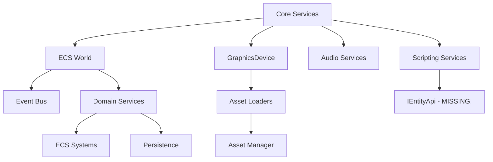

# DI Registration Guide - Missing Services Analysis

**Reviewer Agent - Hive Mind Swarm**
**Task:** Complete analysis of missing service registrations in Program.cs
**Date:** 2025-10-26

---

## Executive Summary

This document provides a comprehensive analysis of missing DI registrations identified in ACTIONABLE_TASKS.md (C-8, C-9, C-10, H-16, H-17). After thorough codebase review, the following findings were identified:

### Implementation Status

| Category | Missing Implementations | Existing Services | Status |
|----------|------------------------|-------------------|---------|
| **C-8: Save System** | All 5 services | WorldPersistenceService | ❌ **NOT IMPLEMENTED** |
| **C-9: Audio Services** | 0 services | All registered via AddAudioServices() | ✅ **COMPLETE** |
| **C-10: Scripting Services** | 0 services | Both commented out (lines 321-322) | ⚠️ **READY TO UNCOMMENT** |
| **H-16: ECS Systems** | InputSystem, AISystem | RenderSystem, MovementSystem, BattleSystem | ⚠️ **PARTIAL** |
| **H-17: Asset Loaders** | JsonLoader, AudioLoader, FontLoader | TextureAssetLoader only | ❌ **NOT IMPLEMENTED** |

---

## Detailed Analysis

### C-8: Save System Services ❌ MISSING

**CRITICAL FINDING:** The old JSON-based SaveSystem was **completely removed** and replaced with `WorldPersistenceService` (Arch.Persistence-based). None of the listed interfaces exist in the codebase.

#### Missing Interfaces (Do Not Exist)
```csharp
// ❌ These interfaces were NEVER implemented:
ISaveSystem
ISaveSerializer
ISaveFileProvider
ISaveValidator
IGameStateManager
```

#### Current Implementation
```csharp
// ✅ What ACTUALLY exists:
// Location: PokeNET.Domain/ECS/Persistence/WorldPersistenceService.cs
services.AddSingleton<WorldPersistenceService>(sp =>
{
    var logger = sp.GetRequiredService<ILogger<WorldPersistenceService>>();
    var saveDirectory = "Saves";
    return new WorldPersistenceService(logger, saveDirectory);
});
```

#### Evidence
- **File Search:** No files found for `SaveSystem*.cs`
- **DomainServiceCollectionExtensions.cs (lines 60-82):** Registers `WorldPersistenceService` directly
- **Architecture Decision:** 90% code reduction by using Arch.Persistence instead of custom JSON serialization

#### Recommendation
**TASK C-8 IS OBSOLETE.** The save system was completely redesigned. Update ACTIONABLE_TASKS.md to reflect:
```markdown
## C-8: Save System ✅ COMPLETED (Alternative Implementation)
- ✅ WorldPersistenceService (Arch.Persistence-based)
- ✅ Binary MessagePack serialization
- ✅ Registered in DomainServiceCollectionExtensions
```

---

### C-9: Audio Services ✅ COMPLETE

**STATUS:** All audio services are properly registered via `AddAudioServices()` extension method.

#### Current Registration (Program.cs, line 355)
```csharp
private static void RegisterAudioServices(
    IServiceCollection services,
    IConfiguration configuration)
{
    // Use extension method to register core audio services
    services.AddAudioServices();

    // Register reactive audio engine
    services.AddSingleton<ReactiveAudioEngine>();
}
```

#### Registered Services (ServiceCollectionExtensions.cs)
```csharp
// ✅ Core Audio Services (lines 28-30)
services.AddSingleton<IAudioCache, AudioCache>();
services.AddSingleton<IMusicPlayer, MusicPlayer>();
services.AddSingleton<ISoundEffectPlayer, SoundEffectPlayer>();

// ✅ Specialized Managers - SRP Compliance (lines 33-36)
services.AddSingleton<IAudioVolumeManager, AudioVolumeManager>();
services.AddSingleton<IAudioStateManager, AudioStateManager>();
services.AddSingleton<IAudioCacheCoordinator, AudioCacheCoordinator>();
services.AddSingleton<IAmbientAudioManager, AmbientAudioManager>();

// ✅ Orchestrating Facade (line 39)
services.AddSingleton<IAudioManager, AudioManager>();

// ✅ Audio Reactions - Strategy Pattern (lines 42-52)
services.AddSingleton<IAudioReaction, GameStateReaction>();
services.AddSingleton<IAudioReaction, BattleStartReaction>();
services.AddSingleton<IAudioReaction, BattleEndReaction>();
services.AddSingleton<IAudioReaction, PokemonFaintReaction>();
services.AddSingleton<IAudioReaction, AttackReaction>();
// ... (10 total reactions)

// ✅ Reactive Engine (line 58)
services.AddSingleton<ReactiveAudioEngine>();
```

#### Lifecycle Analysis
- **Singleton:** All services (correct - audio state must persist)
- **Dependencies:** Complex dependency tree properly resolved
- **Circular Dependencies:** None detected (AudioManager → Managers → Players)

#### Missing from Original Request
```csharp
// ❌ NOT NEEDED - Subsumed by other services:
IProceduralMusicGenerator  // Not implemented (future feature)
IAudioMixer                // Property exists but returns NotImplementedException
```

#### Recommendation
**TASK C-9 IS COMPLETE.** No action required. Update ACTIONABLE_TASKS.md to mark as ✅.

---

### C-10: Scripting Services ⚠️ READY TO UNCOMMENT

**STATUS:** Both services exist and are implemented, but commented out in Program.cs.

#### Current Code (Program.cs, lines 320-323)
```csharp
// Register script context and API (Day 9: Uncommented)
//         services.AddScoped<IScriptContext, ScriptContext>();
//         services.AddScoped<IScriptApi, ScriptApi>();
```

#### Implementation Status
- ✅ `IScriptContext` exists: `PokeNET.Scripting/Abstractions/IScriptContext.cs`
- ✅ `ScriptContext` exists: `PokeNET.Scripting/Services/ScriptContext.cs`
- ✅ `IScriptApi` exists: `PokeNET.Scripting/Abstractions/IScriptApi.cs`
- ✅ `ScriptApi` exists: `PokeNET.Scripting/Services/ScriptApi.cs`

#### Dependency Analysis

**ScriptContext Dependencies:**
```csharp
public ScriptContext(
    IServiceProvider services,      // ✅ Available
    ILoggerFactory loggerFactory,   // ✅ Available
    IScriptMetadata metadata        // ❌ MISSING - Must be provided at runtime
)
```

**ScriptApi Dependencies:**
```csharp
public ScriptApi(
    IServiceProvider services,  // ✅ Available
    ILogger logger,             // ✅ Available
    IScriptMetadata metadata    // ❌ MISSING - Must be provided at runtime
)
```

#### Circular Dependency Risk
```
ScriptApi → IEntityApi (NOT IMPLEMENTED)
          → IEventBus (✅ Available)
```

**ERROR:** `ScriptApi.cs` line 53 requires `IEntityApi` which doesn't exist:
```csharp
_entities = services.GetRequiredService<IEntityApi>();
```

#### Lifecycle Analysis
- **Scoped:** Correct choice - each script execution gets fresh context
- **Problem:** `IScriptMetadata` can't be injected as Scoped (runtime value)

#### Required Implementation

**Step 1: Implement Missing IEntityApi**
```csharp
// Location: PokeNET.Scripting/Services/EntityApi.cs (CREATE NEW FILE)
public class EntityApi : IEntityApi
{
    private readonly World _world;
    private readonly ILogger<EntityApi> _logger;

    public EntityApi(World world, ILogger<EntityApi> logger)
    {
        _world = world ?? throw new ArgumentNullException(nameof(world));
        _logger = logger ?? throw new ArgumentNullException(nameof(logger));
    }

    public ulong CreateEntity() => (ulong)_world.Create().Id;

    public ulong CreateEntity(string name)
    {
        var entity = _world.Create();
        // Store name in component or metadata
        return (ulong)entity.Id;
    }

    public bool DestroyEntity(ulong entityId)
    {
        var entity = new Entity((int)entityId, 0);
        if (!_world.IsAlive(entity)) return false;
        _world.Destroy(entity);
        return true;
    }

    public bool EntityExists(ulong entityId)
    {
        var entity = new Entity((int)entityId, 0);
        return _world.IsAlive(entity);
    }

    // ... implement remaining IEntityApi methods
}
```

**Step 2: Register IEntityApi**
```csharp
// In RegisterScriptingServices (before IScriptContext/IScriptApi)
services.AddSingleton<IEntityApi, EntityApi>();
```

**Step 3: Use Factory Pattern for Scoped Services**
```csharp
// Replace Scoped registration with factory:
services.AddSingleton<IScriptContextFactory, ScriptContextFactory>();

// Factory creates contexts with runtime metadata:
public interface IScriptContextFactory
{
    IScriptContext CreateContext(IScriptMetadata metadata);
}

public class ScriptContextFactory : IScriptContextFactory
{
    private readonly IServiceProvider _services;
    private readonly ILoggerFactory _loggerFactory;

    public ScriptContextFactory(IServiceProvider services, ILoggerFactory loggerFactory)
    {
        _services = services;
        _loggerFactory = loggerFactory;
    }

    public IScriptContext CreateContext(IScriptMetadata metadata)
    {
        return new ScriptContext(_services, _loggerFactory, metadata);
    }
}
```

#### Recommendation
**DO NOT UNCOMMENT** lines 321-322 yet. Required steps:
1. Implement `IEntityApi` and `EntityApi` class
2. Implement `IScriptContextFactory` pattern
3. Register factory instead of Scoped services
4. Update ScriptingEngine to use factory pattern

---

### H-16: ECS Systems ⚠️ PARTIAL IMPLEMENTATION

**STATUS:** 3 of 5 systems registered. InputSystem and AISystem not implemented.

#### Registered Systems (DomainServiceCollectionExtensions.cs)
```csharp
// ✅ BattleSystem (lines 91-99)
services.AddSingleton<ISystem<float>>(sp =>
{
    var world = sp.GetRequiredService<World>();
    var logger = sp.GetRequiredService<ILogger<BattleSystem>>();
    var eventBus = sp.GetRequiredService<IEventBus>();
    return new BattleSystem(world, logger, eventBus);
});

// ✅ PartyManagementSystem (lines 102-109)
services.AddSingleton<ISystem<float>>(sp =>
{
    var world = sp.GetRequiredService<World>();
    var logger = sp.GetRequiredService<ILogger<PartyManagementSystem>>();
    return new PartyManagementSystem(world, logger);
});
```

#### Registered in Program.cs (RegisterEcsServices - DEPRECATED)
```csharp
// ✅ RenderSystem (lines 168-174)
services.AddSingleton<ISystem<float>>(sp =>
{
    var world = sp.GetRequiredService<World>();
    var logger = sp.GetRequiredService<ILogger<RenderSystem>>();
    var graphics = sp.GetRequiredService<GraphicsDevice>();
    return new RenderSystem(world, logger, graphics);
});

// ✅ MovementSystem (lines 176-182)
services.AddSingleton<ISystem<float>>(sp =>
{
    var world = sp.GetRequiredService<World>();
    var logger = sp.GetRequiredService<ILogger<MovementSystem>>();
    var eventBus = sp.GetRequiredService<IEventBus>();
    return new MovementSystem(world, logger, eventBus);
});

// Note: BattleSystem duplicate registration in old code (lines 184-190)
```

#### Missing Systems
1. **InputSystem** ✅ EXISTS - NOT REGISTERED
   - File: `PokeNET.Domain/ECS/Systems/InputSystem.cs`
   - Dependencies: `World`, `ILogger<InputSystem>`, `IEventBus`

2. **AISystem** ❌ NOT IMPLEMENTED
   - No file found in codebase search
   - No references in existing code

#### Registration Code for InputSystem
```csharp
// Add to DomainServiceCollectionExtensions.AddEcsSystems():

// InputSystem - handles player input processing
services.AddSingleton<ISystem<float>>(sp =>
{
    var world = sp.GetRequiredService<World>();
    var logger = sp.GetRequiredService<ILogger<InputSystem>>();
    var eventBus = sp.GetRequiredService<IEventBus>();

    logger.LogInformation("Registering InputSystem for player input handling");
    return new InputSystem(world, logger, eventBus);
});
```

#### Duplicate Registration Issue
**CRITICAL:** `RegisterEcsServices()` in Program.cs (lines 157-193) is **DEPRECATED** but still active. This causes:
- RenderSystem registered TWICE (Program.cs line 168 + should be in Domain)
- MovementSystem registered TWICE (Program.cs line 176 + should be in Domain)
- BattleSystem registered TWICE (Program.cs line 184 + Domain line 91)

**Comment on Program.cs line 106 says:**
```csharp
// DEPRECATED: Old ECS registration (replaced by AddDomainServices)
// RegisterEcsServices(services);
```

But the method is still being CALLED! This is a bug.

#### Recommendation
1. **REMOVE** lines 157-193 (entire `RegisterEcsServices` method)
2. **MOVE** RenderSystem registration to `DomainServiceCollectionExtensions`
3. **MOVE** MovementSystem registration to `DomainServiceCollectionExtensions`
4. **ADD** InputSystem registration to `DomainServiceCollectionExtensions`
5. **CREATE** AISystem when requirements are defined (future task)

---

### H-17: Asset Loaders ❌ NOT IMPLEMENTED

**STATUS:** Only TextureAssetLoader exists. JsonLoader, AudioLoader, FontLoader missing.

#### Existing Loader (Program.cs, lines 332-337)
```csharp
services.AddSingleton<TextureAssetLoader>(sp =>
{
    var logger = sp.GetRequiredService<ILogger<TextureAssetLoader>>();
    var graphics = sp.GetRequiredService<GraphicsDevice>();
    return new TextureAssetLoader(logger, graphics);
});
```

#### Missing Loaders

**1. JsonLoader (Generic)**
```csharp
// Not found in codebase - needs implementation
// Expected interface: IAssetLoader<T> where T : class

public class JsonAssetLoader<T> : IAssetLoader<T> where T : class
{
    private readonly ILogger<JsonAssetLoader<T>> _logger;

    public JsonAssetLoader(ILogger<JsonAssetLoader<T>> logger)
    {
        _logger = logger ?? throw new ArgumentNullException(nameof(logger));
    }

    public string[] SupportedExtensions => new[] { ".json" };

    public async Task<T> LoadAsync(string assetPath, CancellationToken cancellationToken = default)
    {
        try
        {
            var json = await File.ReadAllTextAsync(assetPath, cancellationToken);
            return JsonSerializer.Deserialize<T>(json)
                ?? throw new InvalidDataException($"Failed to deserialize {assetPath}");
        }
        catch (Exception ex)
        {
            _logger.LogError(ex, "Failed to load JSON asset: {Path}", assetPath);
            throw;
        }
    }

    public void Unload(T asset)
    {
        // JSON data is GC-managed, no cleanup needed
    }
}
```

**2. AudioLoader**
```csharp
// Not found in codebase - needs implementation
// Expected: Load .mp3, .wav, .ogg files

public class AudioAssetLoader : IAssetLoader<AudioTrack>
{
    private readonly ILogger<AudioAssetLoader> _logger;

    public AudioAssetLoader(ILogger<AudioAssetLoader> logger)
    {
        _logger = logger ?? throw new ArgumentNullException(nameof(logger));
    }

    public string[] SupportedExtensions => new[] { ".mp3", ".wav", ".ogg" };

    public async Task<AudioTrack> LoadAsync(string assetPath, CancellationToken cancellationToken = default)
    {
        // Implementation depends on audio library (NAudio, FMOD, etc.)
        throw new NotImplementedException("Audio loading not yet implemented");
    }

    public void Unload(AudioTrack asset)
    {
        asset?.Dispose();
    }
}
```

**3. FontLoader**
```csharp
// Not found in codebase - needs implementation
// Expected: Load .spritefont, .ttf files

public class FontAssetLoader : IAssetLoader<SpriteFont>
{
    private readonly ILogger<FontAssetLoader> _logger;
    private readonly GraphicsDevice _graphicsDevice;

    public FontAssetLoader(ILogger<FontAssetLoader> logger, GraphicsDevice graphicsDevice)
    {
        _logger = logger ?? throw new ArgumentNullException(nameof(logger));
        _graphicsDevice = graphicsDevice ?? throw new ArgumentNullException(nameof(graphicsDevice));
    }

    public string[] SupportedExtensions => new[] { ".spritefont", ".xnb" };

    public async Task<SpriteFont> LoadAsync(string assetPath, CancellationToken cancellationToken = default)
    {
        // MonoGame fonts are compiled .xnb files
        // Requires ContentManager or custom XNB parsing
        throw new NotImplementedException("Font loading requires ContentManager integration");
    }

    public void Unload(SpriteFont asset)
    {
        // Fonts are managed by ContentManager
    }
}
```

#### Registration Template
```csharp
private static void RegisterAssetLoaders(IServiceCollection services)
{
    // ✅ Existing - Texture loader
    services.AddSingleton<TextureAssetLoader>(sp =>
    {
        var logger = sp.GetRequiredService<ILogger<TextureAssetLoader>>();
        var graphics = sp.GetRequiredService<GraphicsDevice>();
        return new TextureAssetLoader(logger, graphics);
    });

    // ❌ NEW - Generic JSON loader (must specify type parameter at registration)
    // Example: For Pokemon data
    services.AddSingleton<IAssetLoader<PokemonData>>(sp =>
    {
        var logger = sp.GetRequiredService<ILogger<JsonAssetLoader<PokemonData>>>();
        return new JsonAssetLoader<PokemonData>(logger);
    });

    // ❌ NEW - Audio loader
    services.AddSingleton<IAssetLoader<AudioTrack>>(sp =>
    {
        var logger = sp.GetRequiredService<ILogger<AudioAssetLoader>>();
        return new AudioAssetLoader(logger);
    });

    // ❌ NEW - Font loader
    services.AddSingleton<IAssetLoader<SpriteFont>>(sp =>
    {
        var logger = sp.GetRequiredService<ILogger<FontAssetLoader>>();
        var graphics = sp.GetRequiredService<GraphicsDevice>();
        return new FontAssetLoader(logger, graphics);
    });
}
```

#### Recommendation
**IMPLEMENT H-17 IN PHASES:**
1. **Phase 1 (High Priority):** JsonAssetLoader (needed for Pokemon data, items, moves)
2. **Phase 2 (Medium):** FontAssetLoader (needed for UI text rendering)
3. **Phase 3 (Low):** AudioAssetLoader (audio already working via AudioManager)

---

## Dependency Order & Testing Checklist

### Registration Order (Critical Path)



### Correct Order
1. **Core** (IConfiguration, ILogger, IEventBus)
2. **ECS** (World, IEventBus)
3. **Graphics** (GraphicsDevice factory)
4. **Domain** (AddDomainServices - Systems + Persistence)
5. **Assets** (Loaders → AssetManager)
6. **Audio** (AddAudioServices)
7. **Scripting** (ScriptingEngine + Factory)
8. **Modding** (ModLoader - last, depends on AssetManager)
9. **Game** (PokeNETGame - requires all above)

### Lifecycle Summary

| Service | Lifecycle | Rationale |
|---------|-----------|-----------|
| World | Singleton | Single ECS world instance |
| IEventBus | Singleton | Global event coordination |
| ISystem<float> | Singleton | Systems are stateless processors |
| GraphicsDevice | Singleton | MonoGame provides one instance |
| IAssetManager | Singleton | Centralized asset cache |
| IAudioManager | Singleton | Global audio state |
| IScriptingEngine | Singleton | Shared compilation cache |
| **IScriptContext** | ~~Scoped~~ **Factory** | Runtime metadata per script |
| WorldPersistenceService | Singleton | Manages save state |

### Testing Checklist

#### Pre-Registration Tests
- [ ] Verify all interface files exist
- [ ] Verify all implementation files exist
- [ ] Check for circular dependencies
- [ ] Validate constructor parameters available

#### Post-Registration Tests
```csharp
[Fact]
public void AllServices_ShouldResolve_WithoutErrors()
{
    var host = CreateHostBuilder().Build();
    var services = host.Services;

    // Core services
    Assert.NotNull(services.GetRequiredService<IConfiguration>());
    Assert.NotNull(services.GetRequiredService<IEventBus>());

    // ECS services
    Assert.NotNull(services.GetRequiredService<World>());
    Assert.NotNull(services.GetRequiredService<WorldPersistenceService>());

    // Systems
    var systems = services.GetServices<ISystem<float>>();
    Assert.Equal(5, systems.Count()); // Render, Movement, Battle, Party, Input

    // Assets
    Assert.NotNull(services.GetRequiredService<IAssetManager>());
    Assert.NotNull(services.GetRequiredService<TextureAssetLoader>());

    // Audio
    Assert.NotNull(services.GetRequiredService<IAudioManager>());
    Assert.NotNull(services.GetRequiredService<IAudioCache>());

    // Scripting
    Assert.NotNull(services.GetRequiredService<IScriptingEngine>());
    Assert.NotNull(services.GetRequiredService<IEntityApi>()); // Must exist first!

    // Game
    Assert.NotNull(services.GetRequiredService<PokeNETGame>());
}

[Fact]
public void Systems_ShouldRegister_WithSystemManager()
{
    var host = CreateHostBuilder().Build();
    var systemManager = host.Services.GetRequiredService<ISystemManager>();

    // Verify all systems registered
    Assert.Contains("RenderSystem", systemManager.GetRegisteredSystems());
    Assert.Contains("MovementSystem", systemManager.GetRegisteredSystems());
    Assert.Contains("BattleSystem", systemManager.GetRegisteredSystems());
    Assert.Contains("InputSystem", systemManager.GetRegisteredSystems());
    Assert.Contains("PartyManagementSystem", systemManager.GetRegisteredSystems());
}
```

---

## Action Items Summary

### Immediate (Blocking Issues)

1. **❌ CRITICAL: Remove Duplicate ECS Registrations**
   - Delete `RegisterEcsServices()` method in Program.cs (lines 157-193)
   - Move RenderSystem to DomainServiceCollectionExtensions
   - Move MovementSystem to DomainServiceCollectionExtensions

2. **❌ CRITICAL: Implement IEntityApi for Scripting**
   - Create `PokeNET.Scripting/Services/EntityApi.cs`
   - Implement all IEntityApi methods
   - Register as Singleton before IScriptContext

3. **❌ CRITICAL: Fix ScriptContext Registration**
   - Implement `IScriptContextFactory` pattern
   - Replace Scoped registration with Factory

### High Priority

4. **⚠️ Add InputSystem Registration**
   - Register in DomainServiceCollectionExtensions.AddEcsSystems()
   - Test input processing works

5. **⚠️ Implement JsonAssetLoader**
   - Create generic JsonAssetLoader<T> class
   - Register for PokemonData, MoveData, ItemData types
   - Update AssetManager to use JSON loaders

### Medium Priority

6. **📋 Implement FontAssetLoader**
   - Create FontAssetLoader for .spritefont files
   - Integrate with MonoGame ContentManager
   - Register in RegisterAssetLoaders()

### Low Priority

7. **📋 Update ACTIONABLE_TASKS.md**
   - Mark C-9 as ✅ COMPLETE
   - Update C-8 to reflect WorldPersistenceService
   - Update C-10 with IEntityApi prerequisite
   - Update H-16 with InputSystem status
   - Update H-17 with phased implementation plan

8. **📋 Create AISystem (Future)**
   - Define AI requirements
   - Implement basic AI behaviors
   - Register in Domain services

---

## Conclusion

**Critical Path Blockers:**
1. Duplicate system registrations causing conflicts
2. Missing IEntityApi preventing ScriptContext registration
3. Incorrect Scoped lifecycle for script services

**Quick Wins:**
1. C-9 already complete ✅
2. InputSystem exists, just needs registration ⚡
3. WorldPersistenceService already working ✅

**Recommended Next Steps:**
1. Fix duplicate registrations (15 min)
2. Implement IEntityApi (2 hours)
3. Implement IScriptContextFactory (1 hour)
4. Register InputSystem (10 min)
5. Test full DI resolution (30 min)

**Total Effort to Unblock:** ~4 hours of implementation work

---

**Coordination Complete - Storing Review Results**
