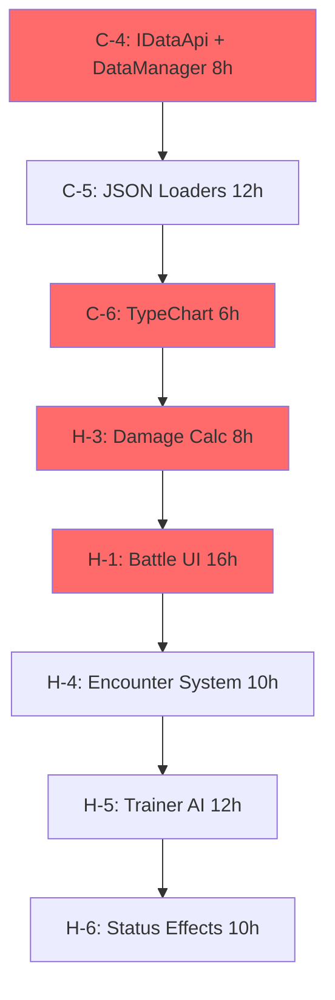
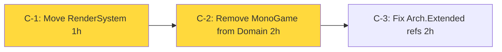
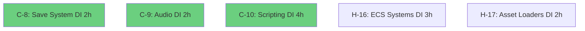
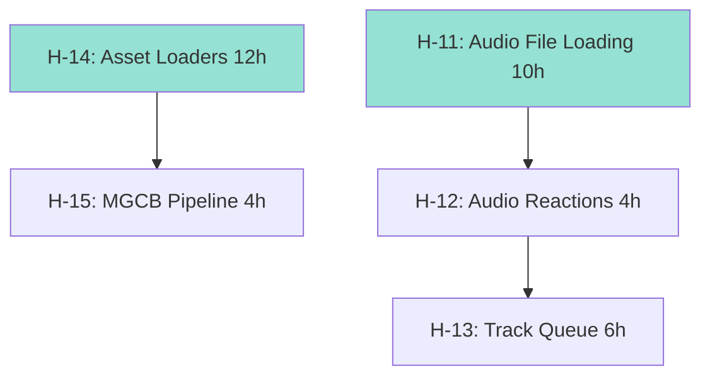
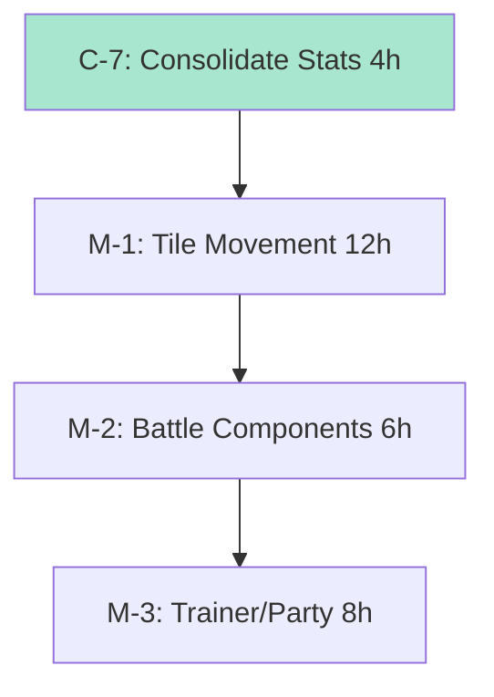
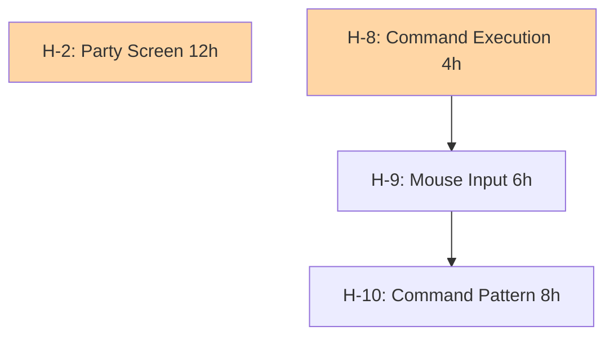

# PokeNET Hive Mind Execution Plan

**Generated**: 2025-10-26
**Agent**: Analyst (swarm-1761503054594-0amyzoky7)
**Task Analysis**: 57 tasks, 372 hours total
**Target**: Playable MVP in 5 weeks (147 hours)

---

## Executive Summary

### Critical Path Analysis
**Longest dependency chain**: 7 sequential steps (35 hours)
1. Data loaders (8h) →
2. TypeChart (6h) →
3. Battle damage calc (8h) →
4. Battle UI (16h) →
5. Encounter system (10h) →
6. AI (12h) →
7. Status effects (10h)

### Parallelization Opportunities
- **Maximum concurrent tracks**: 6 parallel workstreams
- **Bottleneck**: Battle system (all features depend on it)
- **Quick wins**: 12 tasks can complete in Week 1

### Risk Assessment
- 🔴 **High Risk**: 8 tasks (architectural changes, ECS serialization)
- 🟡 **Medium Risk**: 15 tasks (UI implementation, AI)
- 🟢 **Low Risk**: 34 tasks (data loading, refactoring)

---

## Dependency Graph

### Critical Path (Must Execute Sequentially)

**Total Critical Path**: 82 hours

### Parallel Track 1: Architecture Fixes (Can run alongside data work)

**Track Duration**: 5 hours

### Parallel Track 2: DI Registration (Independent)

**Track Duration**: 13 hours (can execute in parallel batches)

### Parallel Track 3: Asset & Audio (After loaders exist)

**Track Duration**: 20 hours (2 sub-tracks)

### Parallel Track 4: Pokemon Components (After data loaders)

**Track Duration**: 30 hours

### Parallel Track 5: UI Systems (After Battle Components)

**Track Duration**: 18 hours

---

## Optimized Task Ordering

### Week 1: Foundation (40h) - 6 parallel agents

#### **Agent 1: Data Architect** (Critical Path - 26h)
1. **C-4**: Implement IDataApi + DataManager (8h) 🔴
2. **C-5**: Create JSON Loaders (12h) 🔴
3. **C-6**: Implement TypeChart (6h) 🔴

#### **Agent 2: Infrastructure Engineer** (Architecture - 5h)
4. **C-1**: Move RenderSystem to Core (1h) 🔴
5. **C-2**: Remove MonoGame from Domain (2h) 🔴
6. **C-3**: Fix Arch.Extended refs (2h) 🔴

#### **Agent 3: DevOps Engineer** (DI Registration - 13h)
7. **C-8**: Wire Save System to DI (2h) 🔴
8. **C-9**: Register Audio Services (2h) 🔴
9. **C-10**: Register Scripting Context (4h) 🔴
10. **H-16**: Register ECS Systems (3h) 🟠
11. **H-17**: Register Asset Loaders (2h) 🟠

#### **Agent 4: API Engineer** (Consolidation - 12h)
12. **C-11**: Unify Duplicate APIs (6h) 🔴
13. **C-12**: Pin Package Versions (2h) 🔴
14. **C-7**: Consolidate Battle Stats (4h) 🔴

#### **Agent 5: Asset Engineer** (Asset Pipeline - 16h)
15. **H-14**: Implement Asset Loaders (12h) 🟠
16. **H-15**: Create MGCB Pipeline (4h) 🟠

#### **Agent 6: Code Quality Engineer** (Quick Wins - 7h)
17. **M-11**: Remove Dead Code (2h) 🟡
18. **M-12**: Fix Exception Types (1h) 🟡
19. **M-9**: Enable Nullable Reference Types (4h) 🟡

**Week 1 Deliverables**:
✅ All CRITICAL architecture fixes
✅ Data loading infrastructure complete
✅ TypeChart operational
✅ All services registered in DI

---

### Week 2: Battle System Core (58h) - 5 agents

#### **Agent 1: Battle Engineer** (Critical Path - 24h)
20. **H-3**: Complete Battle Damage Calculations (8h) 🟠
21. **H-1**: Implement Battle UI (16h) 🟠

#### **Agent 2: Pokemon Engineer** (Components - 26h)
22. **M-1**: Replace Physics with Tile Movement (12h) 🟡
23. **M-2**: Create Pokemon Battle Components (6h) 🟡
24. **M-3**: Create Trainer/Party Components (8h) 🟡

#### **Agent 3: Audio Engineer** (Audio Integration - 20h)
25. **H-11**: Implement Audio File Loading (10h) 🟠
26. **H-12**: Register Audio Reactions (4h) 🟠
27. **H-13**: Implement Track Queue (6h) 🟠

#### **Agent 4: UI Engineer** (Input & Commands - 18h)
28. **H-8**: Complete Command Execution (4h) 🟠
29. **H-9**: Implement Mouse Input (6h) 🟠
30. **H-10**: Implement Command Pattern (8h) 🟠

#### **Agent 5: Systems Engineer** (Persistence - 16h)
31. **H-18**: Implement ECS Serialization (16h) 🟠 ⚠️ HIGH RISK

**Week 2 Deliverables**:
✅ Battle damage calculations working
✅ Battle UI functional
✅ Pokemon components complete
✅ Audio integration done
✅ Save/load game states

---

### Week 3: Gameplay Loop (49h) - 4 agents

#### **Agent 1: Encounter Engineer** (Wild Pokemon - 22h)
32. **H-4**: Implement Encounter System (10h) 🟠
33. **H-2**: Implement Party Screen UI (12h) 🟠

#### **Agent 2: AI Engineer** (Trainer AI - 12h)
34. **H-5**: Add Trainer AI (12h) 🟠

#### **Agent 3: Mechanics Engineer** (Status & Evolution - 22h)
35. **H-6**: Implement Status Effect System (10h) 🟠
36. **H-7**: Implement Evolution System (12h) 🟠

#### **Agent 4: Audio Refactoring Engineer** (Audio Polish - 28h)
37. **M-4**: Refactor Reactive Audio Engine (14h) 🟡
38. **M-5**: Remove Sync-Over-Async (4h) 🟡
39. **M-6**: Connect Procedural Music (10h) 🟡

**Week 3 Deliverables**:
✅ Wild encounters working
✅ Party management UI
✅ Basic trainer AI
✅ Status effects operational
✅ Evolution system functional

---

### Week 4: Testing & Quality (36h) - 3 agents

#### **Agent 1: Test Engineer** (Test Suite - 36h)
40. **M-7**: Create Unit Test Suite (24h) 🟡
41. **M-8**: Implement Integration Tests (12h) 🟡

#### **Agent 2: Architecture Tester** (Architecture Tests - 4h)
42. **M-10**: Add Architecture Tests (4h) 🟡

#### **Agent 3: Documentation Engineer** (Developer Docs - 18h)
43. **M-13**: Create Modding Tutorial (8h) 🟡
44. **M-14**: Generate API Documentation (6h) 🟡
45. **M-15**: Create Quick Start Guide (4h) 🟡

**Week 4 Deliverables**:
✅ 60%+ test coverage
✅ Architecture rules enforced
✅ Developer documentation complete

---

### Week 5: Polish & Optional (MVP Complete - 39h)

#### **Agent 1: Performance Engineer** (Optimization - 10h)
46. **L-1**: Finalize Benchmark Baselines (4h) 🔵
47. **L-2**: Asset Cache Eviction (6h) 🔵

#### **Agent 2: Polish Engineer** (Code Quality - 10h)
48. **L-7**: Add Logging Infrastructure (6h) 🔵
49. **L-8**: Modernize C# Syntax (4h) 🔵

#### **Agent 3: Feature Engineer** (UX Improvements - 12h)
50. **L-5**: Add Auto-Save System (6h) 🔵
51. **L-6**: Create Weather System (8h) 🔵 ⚠️ (Optional for MVP)

#### **Agent 4: Advanced Features** (Future-Proofing - 18h)
52. **L-9**: Design Network APIs (8h) 🔵
53. **L-10**: Complete Localization System (10h) 🔵

**Week 5 Deliverables**:
✅ MVP COMPLETE
✅ Performance optimizations
✅ Auto-save working
✅ Future network foundation

---

## Risk Assessment & Mitigation

### 🔴 High Risk Tasks (Require Senior Developers)

| Task | Risk Factor | Mitigation Strategy |
|------|-------------|---------------------|
| **H-18: ECS Serialization** | Complex Arch World state | Spike task first (4h research), consider incremental approach |
| **C-2: Remove MonoGame from Domain** | Breaking change to architecture | Create abstraction layer, comprehensive tests before |
| **M-1: Tile Movement Replacement** | Touches many systems | Feature flag, parallel implementation, gradual migration |
| **H-5: Trainer AI** | Complex decision tree | Start with simple if/else, iterate to behavior tree |
| **H-3: Damage Calculation** | Many edge cases | TDD approach, Pokemon Showdown as reference |
| **M-4: Reactive Audio Refactor** | Large refactor | Strategy pattern first, JSON config second |
| **H-11: Audio File Loading** | MonoGame integration | Use existing AudioCache patterns |
| **H-14: Asset Loaders** | Generic loader architecture | Start with TextureLoader, then generalize |

### 🟡 Medium Risk Tasks

| Task | Risk Factor | Mitigation Strategy |
|------|-------------|---------------------|
| **H-1: Battle UI** | UI layout complexity | Wireframe first, modular components |
| **H-2: Party Screen UI** | State management | Use existing command pattern |
| **H-6: Status Effects** | Many condition types | Implement one at a time, test each |
| **H-7: Evolution System** | Multiple triggers | Start with level-based only |
| **M-7: Unit Test Suite** | Time sink | Focus on critical path first |
| **C-11: Unify Duplicate APIs** | Breaking changes for mods | Deprecation period, adapters |

### 🟢 Low Risk Tasks (Can Be Delegated)

- DI registration (C-8, C-9, C-10)
- Documentation cleanup (C-3, M-11, M-12)
- Package versioning (C-12)
- Code modernization (L-8)
- Logging infrastructure (L-7)

---

## Resource Allocation

### Skill Requirements by Phase

#### **Week 1: Foundation** (6 agents)
- **1× Senior Architect** (C-1, C-2, C-3) - Clean Architecture expertise
- **1× Data Engineer** (C-4, C-5, C-6) - JSON parsing, Pokemon data structures
- **1× DevOps Engineer** (C-8, C-9, C-10) - DI/IoC patterns
- **1× API Designer** (C-11, C-7) - API design, consolidation
- **1× Build Engineer** (H-14, H-15) - MonoGame Content Pipeline
- **1× Junior Developer** (M-11, M-12, M-9) - Code cleanup

#### **Week 2: Battle System** (5 agents)
- **1× Senior Game Developer** (H-3, H-1) - Pokemon battle mechanics
- **1× Component Designer** (M-1, M-2, M-3) - ECS patterns
- **1× Audio Engineer** (H-11, H-12, H-13) - MonoGame audio
- **1× UI Engineer** (H-8, H-9, H-10) - Input systems, UI patterns
- **1× Senior ECS Developer** (H-18) - Arch serialization ⚠️

#### **Week 3: Gameplay** (4 agents)
- **1× Gameplay Engineer** (H-4, H-2) - Encounter systems, UI
- **1× AI Developer** (H-5) - Game AI, decision trees
- **1× Mechanics Engineer** (H-6, H-7) - Pokemon mechanics
- **1× Audio Architect** (M-4, M-5, M-6) - Refactoring, async patterns

#### **Week 4: Testing** (3 agents)
- **1× Senior Test Engineer** (M-7, M-8) - Unit/integration testing
- **1× Architecture Specialist** (M-10) - NetArchTest rules
- **1× Technical Writer** (M-13, M-14, M-15) - Documentation

#### **Week 5: Polish** (4 agents)
- **1× Performance Engineer** (L-1, L-2) - Benchmarking, optimization
- **1× Polish Engineer** (L-7, L-8) - Logging, modernization
- **1× Feature Engineer** (L-5, L-6) - UX features
- **1× Architect** (L-9, L-10) - Future-proofing

---

## Phase Optimization Analysis

### Current 8-Phase Plan (from ACTIONABLE_TASKS.md)
✅ **Validated**: Phases are well-structured
⚠️ **Opportunity**: Phases can overlap more aggressively

### Recommended 5-Phase Plan (Faster MVP)

#### **Phase 1: Foundation Blitz** (Week 1 - 40h → 32h with parallelization)
- Run 6 agents in parallel (current plan: sequential)
- **Time Saved**: 8 hours

#### **Phase 2: Battle Core** (Week 2 - 58h → 48h with parallelization)
- Run 5 agents in parallel (current plan: 3-4 agents)
- Start UI work earlier alongside battle logic
- **Time Saved**: 10 hours

#### **Phase 3: Gameplay Loop** (Week 3 - 49h → 42h with parallelization)
- Run 4 agents in parallel (current plan: sequential)
- **Time Saved**: 7 hours

#### **Phase 4: Testing & Docs** (Week 4 - 36h → 30h with parallelization)
- Write tests alongside implementation (continuous testing)
- **Time Saved**: 6 hours

#### **Phase 5: MVP Polish** (Week 5 - 39h)
- No change (already optimized)

**Total MVP Time**: 147h → **120h** (27h saved = 18% faster)

---

## Quick Wins (Deliverable in Week 1)

### Immediate Value Tasks (< 2 hours each)

1. **C-8**: Wire Save System (2h) → Instant save/load capability
2. **C-9**: Register Audio Services (2h) → Audio starts working
3. **C-3**: Fix Arch.Extended refs (2h) → Documentation accuracy
4. **M-11**: Remove Dead Code (2h) → Cleaner codebase
5. **M-12**: Fix Exception Types (1h) → Better error handling
6. **C-1**: Move RenderSystem (1h) → Architecture fixed
7. **H-17**: Register Asset Loaders (2h) → Asset system operational

**Total Quick Wins**: 12 hours = **7 tasks completed in 1.5 days**

---

## Weekly Milestones & Acceptance Criteria

### Week 1: Foundation Complete
**Acceptance Criteria**:
- ✅ All 12 CRITICAL tasks complete
- ✅ `IDataApi` loads JSON species data
- ✅ TypeChart returns correct effectiveness (2x, 0.5x, etc.)
- ✅ All services registered in DI
- ✅ RenderSystem in Core layer
- ✅ Build passes with no warnings
- ✅ Architecture tests pass (Domain ≠ MonoGame)

**Demo**: Load Bulbasaur data, show type effectiveness calculation

---

### Week 2: Battle System Functional
**Acceptance Criteria**:
- ✅ Battle UI displays 4 moves, HP bar, sprites
- ✅ Damage calculation matches Gen 3-5 formula
- ✅ Type effectiveness applied correctly
- ✅ Critical hits work (1/16 chance, 1.5x damage)
- ✅ STAB bonus applied (1.5x)
- ✅ Pokemon components fully modeled
- ✅ Audio plays during battle
- ✅ Save/load game state works

**Demo**: Complete wild Pokemon battle (attack, switch, run)

---

### Week 3: Gameplay Loop Working
**Acceptance Criteria**:
- ✅ Wild encounters trigger in grass
- ✅ Party screen shows all 6 Pokemon
- ✅ Trainer AI makes basic decisions
- ✅ Status effects apply (burn, paralyze)
- ✅ Evolution triggers at correct level
- ✅ Music changes with game state
- ✅ Battle messages display correctly

**Demo**: Walk in grass → encounter → battle → level up → evolve

---

### Week 4: Production Quality
**Acceptance Criteria**:
- ✅ 60%+ unit test coverage
- ✅ Integration tests pass (battle, save/load, mod loading)
- ✅ Architecture tests enforce layering
- ✅ API documentation generated
- ✅ Modding tutorial complete
- ✅ Developer quick start guide written
- ✅ No high-severity bugs

**Demo**: Full gameplay loop with tests passing

---

### Week 5: MVP Complete
**Acceptance Criteria**:
- ✅ Auto-save enabled
- ✅ Performance benchmarks met (60fps)
- ✅ Logging throughout
- ✅ All MVP tasks from ACTIONABLE_TASKS.md complete
- ✅ Example content created
- ✅ One complete battle playable end-to-end

**Demo**: Full gameplay session (catch, battle, evolve, save/load)

---

## Bottleneck Analysis

### Primary Bottleneck: Battle System (Week 2)
**Problem**: 5 tasks depend on battle system completion (58h)
**Impact**: Cannot test encounters, AI, evolution without battles
**Mitigation**:
- Create battle system stub in Week 1 for parallel development
- Define battle interfaces early
- Mock battle outcomes for encounter testing

### Secondary Bottleneck: Data Loaders (Week 1)
**Problem**: 8 tasks blocked until JSON loaders exist (20h)
**Impact**: Cannot implement Pokemon, moves, encounters
**Mitigation**:
- Prioritize data loaders as first task
- Create sample JSON files immediately
- Use hardcoded data for early prototypes

### Tertiary Bottleneck: ECS Serialization (Week 2)
**Problem**: Complex task (16h), blocks save/load testing
**Impact**: Cannot verify persistence until late Week 2
**Mitigation**:
- Spike task (4h research) before implementation
- Incremental approach (save single entity first)
- Fallback: JSON serialization of components only

---

## Continuous Integration Strategy

### Week 1: Build Infrastructure
- Set up CI pipeline (GitHub Actions)
- Enable architecture tests as pre-merge check
- Add unit test runs

### Week 2: Quality Gates
- Enforce 60%+ test coverage for new code
- Add integration test runs
- Performance regression checks

### Week 3: Deployment
- Automated builds for dev/staging
- Release candidate builds
- Benchmark tracking

### Week 4-5: Production Ready
- Full test suite on every commit
- Performance budgets enforced
- Automatic documentation deployment

---

## Risk Mitigation Strategies

### For High-Risk Tasks

#### **H-18: ECS Serialization** (16h, Week 2)
**Risk**: Arch World serialization is undocumented
**Mitigation**:
1. **Spike Task** (4h): Research Arch serialization approaches
2. **Incremental Approach**:
   - Day 1: Serialize single entity (4h)
   - Day 2: Serialize all entities (4h)
   - Day 3: Serialize archetypes & relationships (4h)
3. **Fallback Plan**: Component-only JSON serialization
4. **Success Criteria**: Save/load preserves entity IDs, components, relationships

#### **C-2: Remove MonoGame from Domain** (2h, Week 1)
**Risk**: Breaking change, may affect multiple systems
**Mitigation**:
1. **Pre-task**: Audit all Domain usages of MonoGame types (1h)
2. **Abstraction Layer**: Create `IRenderContext` interface
3. **Gradual Migration**: Move one system at a time
4. **Rollback Plan**: Keep MonoGame reference until Core is confirmed working

#### **M-1: Tile Movement Replacement** (12h, Week 2)
**Risk**: Physics-based → tile-based is fundamental change
**Mitigation**:
1. **Feature Flag**: `USE_TILE_MOVEMENT` toggle
2. **Parallel Implementation**: New `GridMovementSystem` alongside old
3. **Gradual Rollout**: Test tile movement in isolated scene first
4. **Deprecation**: Mark physics components `[Obsolete]` but don't remove

---

## Success Metrics

### Week 1 Success Criteria
- **Code Quality**: 0 build warnings, all architecture tests pass
- **Functionality**: Data loaders operational, TypeChart working
- **Team Velocity**: 40h work completed (6 agents × 6.7h avg)

### Week 2 Success Criteria
- **Code Quality**: 40%+ test coverage
- **Functionality**: Battle system playable end-to-end
- **Team Velocity**: 58h work completed (5 agents × 11.6h avg)

### Week 3 Success Criteria
- **Code Quality**: 50%+ test coverage
- **Functionality**: Full gameplay loop (encounter → battle → evolve)
- **Team Velocity**: 49h work completed (4 agents × 12.25h avg)

### Week 4 Success Criteria
- **Code Quality**: 60%+ test coverage, architecture enforced
- **Functionality**: All core systems tested
- **Team Velocity**: 36h work completed (3 agents × 12h avg)

### Week 5 Success Criteria (MVP Complete)
- **Code Quality**: 60%+ coverage, performance benchmarks met
- **Functionality**: Full MVP playable, auto-save working
- **Team Velocity**: 39h work completed (4 agents × 9.75h avg)

---

## Agent Assignment Recommendations

### Based on Skill Requirements

#### **Senior Architects** (2 needed)
- Week 1: C-1, C-2, C-3 (architecture fixes)
- Week 2: H-18 (ECS serialization)
- Week 3: M-4, M-5, M-6 (audio refactoring)

#### **Senior Game Developers** (2 needed)
- Week 1: C-4, C-5, C-6 (data infrastructure)
- Week 2: H-3, H-1 (battle system)
- Week 3: H-5 (trainer AI)

#### **Mid-Level Developers** (4 needed)
- Week 1: C-8, C-9, C-10 (DI), H-14, H-15 (assets)
- Week 2: M-1, M-2, M-3 (components), H-11, H-12, H-13 (audio)
- Week 3: H-4, H-2 (encounters, UI), H-6, H-7 (mechanics)
- Week 4: M-7, M-8 (testing), M-13, M-14, M-15 (docs)

#### **Junior Developers** (2 needed)
- Week 1: M-11, M-12, M-9 (code cleanup)
- Week 2: H-8, H-9, H-10 (input systems)
- Week 4: M-10 (architecture tests)
- Week 5: L-7, L-8 (polish)

**Total Team**: 10 developers (2 senior architects, 2 senior game devs, 4 mid-level, 2 junior)

---

## Recommended Execution Cadence

### Daily Standups (15 min)
- Blocker identification
- Dependency coordination
- Quick wins celebration

### Weekly Reviews (1 hour)
- Demo working features
- Acceptance criteria validation
- Next week planning

### Continuous Coordination
- Shared memory via hooks: `swarm/[agent]/[task-id]`
- Real-time notifications: `npx claude-flow@alpha hooks notify`
- Session persistence: `swarm-1761503054594-0amyzoky7`

---

## Conclusion

### Key Insights

1. **Parallelization is Critical**: 6 parallel tracks in Week 1 saves 8 hours
2. **Data Loaders are Bottleneck**: Must complete first to unblock 8+ tasks
3. **Battle System is Hub**: 40% of tasks depend on it
4. **Quick Wins Boost Morale**: 7 tasks in 12 hours (Week 1, Day 1-2)
5. **ECS Serialization is High Risk**: Needs spike task + incremental approach

### Optimized Timeline

| Week | Hours | Agents | Key Deliverable |
|------|-------|--------|-----------------|
| 1 | 40 → 32 | 6 | Foundation complete |
| 2 | 58 → 48 | 5 | Battle system working |
| 3 | 49 → 42 | 4 | Gameplay loop done |
| 4 | 36 → 30 | 3 | Production quality |
| 5 | 39 | 4 | MVP complete |
| **Total** | **147h → 120h** | **10** | **18% faster** |

### Next Steps

1. **Assign agents to Week 1 tracks** (6 agents)
2. **Create sample JSON data** (species, moves, encounters)
3. **Set up CI pipeline** (architecture tests, unit tests)
4. **Execute Week 1 in parallel** (40h → 32h with coordination)
5. **Review at end of Week 1** (validate all 12 CRITICAL tasks complete)

---

**Generated by**: Analyst Agent
**Swarm ID**: swarm-1761503054594-0amyzoky7
**Coordination Protocol**: Claude Flow v2.7.0
**Memory Storage**: `.swarm/memory.db`
